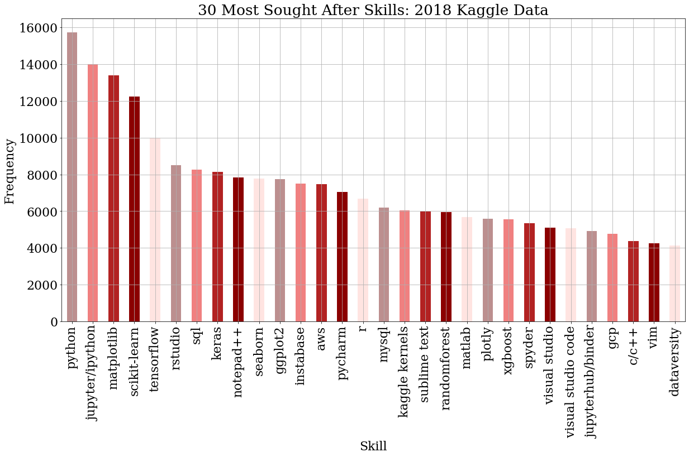
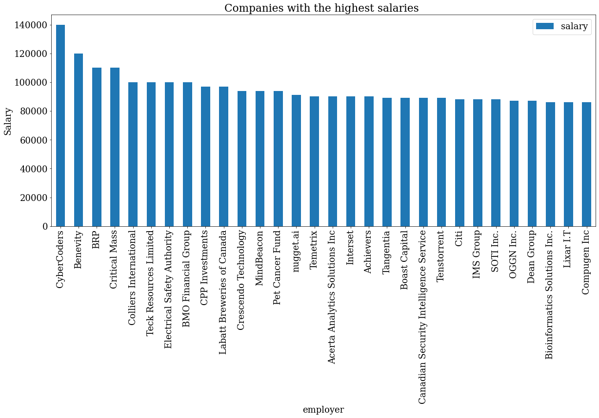

```python
!pip install beautifulsoup4
!pip install selenium

import pandas as pd
import numpy as np
import requests
import re
import csv
import os
import matplotlib.pyplot as plt
import seaborn as sb

from bs4 import BeautifulSoup

from time import sleep
import warnings
warnings.filterwarnings('ignore')


from sklearn.preprocessing import normalize
import scipy.cluster.hierarchy as sch
from scipy import zeros as sci_zeros
from scipy.spatial.distance import euclidean
from scipy.cluster.hierarchy import dendrogram
from sklearn.cluster import AgglomerativeClustering

%matplotlib inline
```

# Part 1: Course curriculum design


```python
kaggle_data = pd.read_csv('multiple_choice_responses.csv')
kaggle_data.head()
```


<div>
<style scoped>
    .dataframe tbody tr th:only-of-type {
        vertical-align: middle;
    }

    .dataframe tbody tr th {
        vertical-align: top;
    }

    .dataframe thead th {
        text-align: right;
    }
</style>
<table border="1" class="dataframe">
  <thead>
    <tr style="text-align: right;">
      <th></th>
      <th>Time from Start to Finish (seconds)</th>
      <th>Q1</th>
      <th>Q2</th>
      <th>Q2_OTHER_TEXT</th>
      <th>Q3</th>
      <th>Q4</th>
      <th>Q5</th>
      <th>Q5_OTHER_TEXT</th>
      <th>Q6</th>
      <th>Q7</th>
      <th>...</th>
      <th>Q34_Part_4</th>
      <th>Q34_Part_5</th>
      <th>Q34_Part_6</th>
      <th>Q34_Part_7</th>
      <th>Q34_Part_8</th>
      <th>Q34_Part_9</th>
      <th>Q34_Part_10</th>
      <th>Q34_Part_11</th>
      <th>Q34_Part_12</th>
      <th>Q34_OTHER_TEXT</th>
    </tr>
  </thead>
  <tbody>
    <tr>
      <th>0</th>
      <td>Duration (in seconds)</td>
      <td>What is your age (# years)?</td>
      <td>What is your gender? - Selected Choice</td>
      <td>What is your gender? - Prefer to self-describe...</td>
      <td>In which country do you currently reside?</td>
      <td>What is the highest level of formal education ...</td>
      <td>Select the title most similar to your current ...</td>
      <td>Select the title most similar to your current ...</td>
      <td>What is the size of the company where you are ...</td>
      <td>Approximately how many individuals are respons...</td>
      <td>...</td>
      <td>Which of the following relational database pro...</td>
      <td>Which of the following relational database pro...</td>
      <td>Which of the following relational database pro...</td>
      <td>Which of the following relational database pro...</td>
      <td>Which of the following relational database pro...</td>
      <td>Which of the following relational database pro...</td>
      <td>Which of the following relational database pro...</td>
      <td>Which of the following relational database pro...</td>
      <td>Which of the following relational database pro...</td>
      <td>Which of the following relational database pro...</td>
    </tr>
    <tr>
      <th>1</th>
      <td>510</td>
      <td>22-24</td>
      <td>Male</td>
      <td>-1</td>
      <td>France</td>
      <td>Master’s degree</td>
      <td>Software Engineer</td>
      <td>-1</td>
      <td>1000-9,999 employees</td>
      <td>0</td>
      <td>...</td>
      <td>NaN</td>
      <td>NaN</td>
      <td>NaN</td>
      <td>NaN</td>
      <td>NaN</td>
      <td>NaN</td>
      <td>NaN</td>
      <td>NaN</td>
      <td>NaN</td>
      <td>-1</td>
    </tr>
    <tr>
      <th>2</th>
      <td>423</td>
      <td>40-44</td>
      <td>Male</td>
      <td>-1</td>
      <td>India</td>
      <td>Professional degree</td>
      <td>Software Engineer</td>
      <td>-1</td>
      <td>&gt; 10,000 employees</td>
      <td>20+</td>
      <td>...</td>
      <td>NaN</td>
      <td>NaN</td>
      <td>NaN</td>
      <td>NaN</td>
      <td>NaN</td>
      <td>NaN</td>
      <td>NaN</td>
      <td>NaN</td>
      <td>NaN</td>
      <td>-1</td>
    </tr>
    <tr>
      <th>3</th>
      <td>83</td>
      <td>55-59</td>
      <td>Female</td>
      <td>-1</td>
      <td>Germany</td>
      <td>Professional degree</td>
      <td>NaN</td>
      <td>-1</td>
      <td>NaN</td>
      <td>NaN</td>
      <td>...</td>
      <td>NaN</td>
      <td>NaN</td>
      <td>NaN</td>
      <td>NaN</td>
      <td>NaN</td>
      <td>NaN</td>
      <td>NaN</td>
      <td>NaN</td>
      <td>NaN</td>
      <td>-1</td>
    </tr>
    <tr>
      <th>4</th>
      <td>391</td>
      <td>40-44</td>
      <td>Male</td>
      <td>-1</td>
      <td>Australia</td>
      <td>Master’s degree</td>
      <td>Other</td>
      <td>0</td>
      <td>&gt; 10,000 employees</td>
      <td>20+</td>
      <td>...</td>
      <td>NaN</td>
      <td>NaN</td>
      <td>NaN</td>
      <td>NaN</td>
      <td>NaN</td>
      <td>Azure SQL Database</td>
      <td>NaN</td>
      <td>NaN</td>
      <td>NaN</td>
      <td>-1</td>
    </tr>
  </tbody>
</table>
<p>5 rows × 246 columns</p>
</div>


```python
# Helper function to turn skills into columns and encode them
def get_skills_df(df):
    for col in df.columns.values:
        skill = df[pd.notnull(df[col])][col].unique()[0] # get the selected choice for the corresponding col
        df.loc[:, col] = df.loc[:, col].map({skill: 1})
        skill_name = skill.lower()
        while skill_name[0] == " ":
            skill_name = skill_name[1:]
        while skill_name[-1] == " ":
            skill_name = skill_name[:-1]
        df.rename(columns={col:skill_name}, inplace=True)
    df.fillna(0, inplace=True)
    
    return df
```


```python
# programming languages, Q18 in the dataset (10 options)
languages = kaggle_data[['Q18_Part_1', 'Q18_Part_2', 'Q18_Part_3', 'Q18_Part_4', 'Q18_Part_5', 'Q18_Part_6', 'Q18_Part_7', 
                       'Q18_Part_8', 'Q18_Part_9', 'Q18_Part_10']]
languages.drop([0], inplace=True)
languages = get_skills_df(languages)


# Get Visualization tools used: Q20
viz_tools = kaggle_data[['Q20_Part_1', 'Q20_Part_2', 'Q20_Part_3', 'Q20_Part_4', 'Q20_Part_5', 'Q20_Part_6', 'Q20_Part_7', 
                       'Q20_Part_8', 'Q20_Part_9', 'Q20_Part_10']]
viz_tools.drop([0], inplace=True)
viz_tools = get_skills_df(viz_tools)


# Get ML algorithms used on a regular basis: Q24
ml_algo = kaggle_data[['Q24_Part_1', 'Q24_Part_2', 'Q24_Part_3', 'Q24_Part_4', 'Q24_Part_5', 'Q24_Part_6', 'Q24_Part_7', 
                       'Q24_Part_8', 'Q24_Part_9', 'Q24_Part_10']]
ml_algo.drop([0], inplace=True)
ml_algo = get_skills_df(ml_algo)


# Get ML algorithms used on a regular basis: Q24
ml_algo = kaggle_data[['Q24_Part_1', 'Q24_Part_2', 'Q24_Part_3', 'Q24_Part_4', 'Q24_Part_5', 'Q24_Part_6', 'Q24_Part_7', 
                       'Q24_Part_8', 'Q24_Part_9', 'Q24_Part_10']]
ml_algo.drop([0], inplace=True)
ml_algo = get_skills_df(ml_algo)


# Get Computer Vision methods used on a regular basis
computer_vision = kaggle_data[['Q26_Part_1', 'Q26_Part_2', 'Q26_Part_3', 'Q26_Part_4', 'Q26_Part_5']]
computer_vision.drop([0], inplace=True)
computer_vision = get_skills_df(computer_vision)


# Get NLP methods used on a regular basis
nlp = kaggle_data[['Q27_Part_1', 'Q27_Part_2', 'Q27_Part_3', 'Q27_Part_4']]
nlp.drop([0], inplace=True)
nlp = get_skills_df(nlp)


# Get ML frameworks used: Q28
ml_frameworks = kaggle_data[['Q28_Part_1', 'Q28_Part_2', 'Q28_Part_3', 'Q28_Part_4', 'Q28_Part_5', 'Q28_Part_6', 'Q28_Part_7', 'Q28_Part_8', 'Q28_Part_9', 'Q28_Part_10']]
ml_frameworks.drop([0], inplace=True)
ml_frameworks = get_skills_df(ml_frameworks)


# Get cloud computing platforms used: Q29
cloud_computing = kaggle_data[['Q29_Part_1', 'Q29_Part_2', 'Q29_Part_3', 'Q29_Part_4', 'Q29_Part_5', 'Q29_Part_6',
                               'Q29_Part_7','Q29_Part_8', 'Q29_Part_9', 'Q29_Part_10']]
cloud_computing.drop([0], inplace=True)
cloud_computing = get_skills_df(cloud_computing)


# Get big data/ analytics products used: Q31
big_data = kaggle_data[['Q31_Part_1', 'Q31_Part_2', 'Q31_Part_3', 'Q31_Part_4', 'Q31_Part_5', 'Q31_Part_6',
                               'Q31_Part_7','Q31_Part_8', 'Q31_Part_9', 'Q31_Part_10']]
big_data.drop([0], inplace=True)
big_data = get_skills_df(big_data)


# Get ML products used: Q32
ml_products = kaggle_data[['Q32_Part_1', 'Q32_Part_2', 'Q32_Part_3', 'Q32_Part_4', 'Q32_Part_5', 'Q32_Part_6',
                               'Q32_Part_7','Q32_Part_8', 'Q32_Part_9', 'Q32_Part_10']]
ml_products.drop([0], inplace=True)
ml_products = get_skills_df(ml_products)


# Get database products used: Q34
db_products = kaggle_data[['Q34_Part_1', 'Q34_Part_2', 'Q34_Part_3', 'Q34_Part_4', 'Q34_Part_5', 'Q34_Part_6',
                               'Q34_Part_7','Q34_Part_8', 'Q34_Part_9', 'Q34_Part_10']]
db_products.drop([0], inplace=True)
db_products = get_skills_df(db_products)


# Get database products used: Q34
db_products = kaggle_data[['Q34_Part_1', 'Q34_Part_2', 'Q34_Part_3', 'Q34_Part_4', 'Q34_Part_5', 'Q34_Part_6',
                               'Q34_Part_7','Q34_Part_8', 'Q34_Part_9', 'Q34_Part_10']]
db_products.drop([0], inplace=True)
db_products = get_skills_df(db_products)


# Get database products used: Q34
db_products = kaggle_data[['Q34_Part_1', 'Q34_Part_2', 'Q34_Part_3', 'Q34_Part_4', 'Q34_Part_5', 'Q34_Part_6',
                               'Q34_Part_7','Q34_Part_8', 'Q34_Part_9', 'Q34_Part_10']]
db_products.drop([0], inplace=True)
db_products = get_skills_df(db_products)
```


```python
# Combine all the skills dataframe into one
kaggle_skills = pd.concat([languages, viz_tools, ml_algo, computer_vision, nlp, ml_frameworks, cloud_computing, 
                          big_data, ml_products, db_products], axis=1)
kaggle_skills.head(10)
kaggle_skills = kaggle_skills.rename(columns={'image classification and other general purpose networks (vgg, inception, resnet, resnext, nasnet, efficientnet, etc)': 'image classification', 'general purpose image/video tools (pil, cv2, skimage, etc)': 'image/video tools', 'gradient boosting machines (xgboost, lightgbm, etc)': 'gradient boosting machines', ' google cloud platform (gcp) ': 'gcp'})
kaggle_skills.to_csv('./kaggle_skills.csv', index=True)
```


```python
print(kaggle_skills.columns)
```

    Index(['python', 'r', 'sql', 'c', 'c++', 'java', 'javascript', 'typescript',
           'bash', 'matlab', 'ggplot / ggplot2', 'matplotlib', 'altair', 'shiny',
           'd3.js', 'plotly / plotly express', 'bokeh', 'seaborn', 'geoplotlib',
           'leaflet / folium', 'linear or logistic regression',
           'decision trees or random forests', 'gradient boosting machines',
           'bayesian approaches', 'evolutionary approaches',
           'dense neural networks (mlps, etc)', 'convolutional neural networks',
           'generative adversarial networks', 'recurrent neural networks',
           'transformer networks (bert, gpt-2, etc)', 'image/video tools',
           'image segmentation methods (u-net, mask r-cnn, etc)',
           'object detection methods (yolov3, retinanet, etc)',
           'image classification', 'generative networks (gan, vae, etc)',
           'word embeddings/vectors (glove, fasttext, word2vec)',
           'encoder-decorder models (seq2seq, vanilla transformers)',
           'contextualized embeddings (elmo, cove)',
           'transformer language models (gpt-2, bert, xlnet, etc)', 'scikit-learn',
           'tensorflow', 'keras', 'randomforest', 'xgboost', 'pytorch', 'caret',
           'lightgbm', 'spark mlib', 'fast.ai', 'google cloud platform (gcp)',
           'amazon web services (aws)', 'microsoft azure', 'ibm cloud',
           'alibaba cloud', 'salesforce cloud', 'oracle cloud', 'sap cloud',
           'vmware cloud', 'red hat cloud', 'google bigquery', 'aws redshift',
           'databricks', 'aws elastic mapreduce', 'teradata',
           'microsoft analysis services', 'google cloud dataflow', 'aws athena',
           'aws kinesis', 'google cloud pub/sub', 'sas', 'cloudera',
           'azure machine learning studio', 'google cloud machine learning engine',
           'google cloud vision', 'google cloud speech-to-text',
           'google cloud natural language', 'rapidminer',
           'google cloud translation', 'amazon sagemaker', 'mysql', 'postgressql',
           'sqlite', 'microsoft sql server', 'oracle database', 'microsoft access',
           'aws relational database service', 'aws dynamodb', 'azure sql database',
           'google cloud sql'],
          dtype='object')
    


```python
plt.figure(figsize=(20,10))
my_colors = ["lightsteelblue", "cornflowerblue", "royalblue", "midnightblue", "mediumblue"]*10

font = {'font.family' : 'serif',
        'font.size'   : 22,
        'font.weight' : 'normal'}
plt.rcParams.update(font)
ax = kaggle_skills.sum().sort_values(ascending=False)[:30].plot(kind="bar", color=my_colors)
plt.title("30 Most Sought After Skills: 2019 Kaggle Data")
plt.grid(True)
plt.xlabel("Skill")
plt.ylabel("Frequency")
plt.show()

```


```python
# Indeed displays ~10-15 jobs on each page, while each job itself can be identify as a page.
# So we search jobs every 10 pages.
# For 1000+ jobs, we need to go through 100+ pages with 10+ jobs on each page. 
pages = list(range(0,1100,10))

def get_indeed_jobs():
    job_info = []
    for page in pages:
        result = requests.get("https://ca.indeed.com/jobs?q=data+analyst%2C+data+scientist&start="+str(page)).text
        soup = BeautifulSoup(result, 'lxml')

        if soup.find_all(class_ = "result") is None:
            return []
        for jobs in soup.find_all(class_ = "result"): 
            try:
                position_title = jobs.find('a', class_='jobtitle turnstileLink').text.strip()
            except:
                position_title = None

            try:
                employer = jobs.find('span', class_='company').text.strip()
            except:
                employer = None

            try:
                location = jobs.find('span', class_='location').text.strip()
            except:
                location = None

            try:
                salary = jobs.find('span', class_ = 'salaryText').text.strip()
            except:
                salary = None

            try:
                link = base + jobs.find('a').attrs['href']
            except:
                link = None

            job_info.append({
                'position_title': position_title, 
                'employer': employer,
                'location': location,
                'salary': salary,
                'link': link})

    return job_info
 
#job_info = get_indeed_jobs()
```


```python
#print(len(job_info))
#job_info_df = pd.DataFrame(job_info)
#job_info_df.drop_duplicates(['link'], keep='first')
#job_info_df["position_title"] = job_info_df["position_title"].replace('', np.nan)
#job_info_df = job_info_df.dropna(subset=['position_title'])
#print(job_info_df.shape)
#print(job_info_df.head())
```


```python
'''skills = kaggle_skills.columns.values
for skill in skills:
job_info_df[skill] = np.zeros(len(job_info))
job_info_df.head()'''
```


    'skills = kaggle_skills.columns.values\nfor skill in skills:\njob_info_df[skill] = np.zeros(len(job_info))\njob_info_df.head()'


```python
def get_job_details(job_info):
    for i in range(len(job_info)):
        link = requests.get(job_info.loc[i, 'link'])
        soup = BeautifulSoup(link.text, "lxml")
        try:
            text = soup.find('div', class_ = 'jobsearch-jobDescriptionText').text.strip().lower()
            # Text pre-processing
            text = re.sub(r'\,', ' ', text) 
            text = re.sub('/', ' ', text) 
            text = re.sub(r'\(', ' ', text) 
            text = re.sub(r'\)', ' ', text) 
            text = re.sub(' +',' ',text) 
        except:
            text = ""

        for s in skills :
            # This is specifically for C++, escape the ++. Convert C++ to C\+\+
            if any(x in s for x in ['+']):
                skill = re.escape(s)
            else:
                skill = s

            matching = re.search(r'(?:^|(?<=\s))' + skill + r'(?=\s|$)',text)
            if matching:
                job_info[s][i] = 1
    return job_info
```


```python
#job_info_details = get_job_details(job_info_df)
#job_info_details.to_csv('./indeed_jobs.csv', index=True)
```


```python
kaggle_data_2018 = pd.read_csv('multiple_choice_responses_2018.csv')
kaggle_data_2018.head()
```


<div>
<style scoped>
    .dataframe tbody tr th:only-of-type {
        vertical-align: middle;
    }

    .dataframe tbody tr th {
        vertical-align: top;
    }

    .dataframe thead th {
        text-align: right;
    }
</style>
<table border="1" class="dataframe">
  <thead>
    <tr style="text-align: right;">
      <th></th>
      <th>Time from Start to Finish (seconds)</th>
      <th>Q1</th>
      <th>Q1_OTHER_TEXT</th>
      <th>Q2</th>
      <th>Q3</th>
      <th>Q4</th>
      <th>Q5</th>
      <th>Q6</th>
      <th>Q6_OTHER_TEXT</th>
      <th>Q7</th>
      <th>...</th>
      <th>Q49_OTHER_TEXT</th>
      <th>Q50_Part_1</th>
      <th>Q50_Part_2</th>
      <th>Q50_Part_3</th>
      <th>Q50_Part_4</th>
      <th>Q50_Part_5</th>
      <th>Q50_Part_6</th>
      <th>Q50_Part_7</th>
      <th>Q50_Part_8</th>
      <th>Q50_OTHER_TEXT</th>
    </tr>
  </thead>
  <tbody>
    <tr>
      <th>0</th>
      <td>Duration (in seconds)</td>
      <td>What is your gender? - Selected Choice</td>
      <td>What is your gender? - Prefer to self-describe...</td>
      <td>What is your age (# years)?</td>
      <td>In which country do you currently reside?</td>
      <td>What is the highest level of formal education ...</td>
      <td>Which best describes your undergraduate major?...</td>
      <td>Select the title most similar to your current ...</td>
      <td>Select the title most similar to your current ...</td>
      <td>In what industry is your current employer/cont...</td>
      <td>...</td>
      <td>What tools and methods do you use to make your...</td>
      <td>What barriers prevent you from making your wor...</td>
      <td>What barriers prevent you from making your wor...</td>
      <td>What barriers prevent you from making your wor...</td>
      <td>What barriers prevent you from making your wor...</td>
      <td>What barriers prevent you from making your wor...</td>
      <td>What barriers prevent you from making your wor...</td>
      <td>What barriers prevent you from making your wor...</td>
      <td>What barriers prevent you from making your wor...</td>
      <td>What barriers prevent you from making your wor...</td>
    </tr>
    <tr>
      <th>1</th>
      <td>710</td>
      <td>Female</td>
      <td>-1</td>
      <td>45-49</td>
      <td>United States of America</td>
      <td>Doctoral degree</td>
      <td>Other</td>
      <td>Consultant</td>
      <td>-1</td>
      <td>Other</td>
      <td>...</td>
      <td>-1</td>
      <td>NaN</td>
      <td>NaN</td>
      <td>NaN</td>
      <td>NaN</td>
      <td>NaN</td>
      <td>NaN</td>
      <td>NaN</td>
      <td>NaN</td>
      <td>-1</td>
    </tr>
    <tr>
      <th>2</th>
      <td>434</td>
      <td>Male</td>
      <td>-1</td>
      <td>30-34</td>
      <td>Indonesia</td>
      <td>Bachelor’s degree</td>
      <td>Engineering (non-computer focused)</td>
      <td>Other</td>
      <td>0</td>
      <td>Manufacturing/Fabrication</td>
      <td>...</td>
      <td>-1</td>
      <td>NaN</td>
      <td>NaN</td>
      <td>NaN</td>
      <td>NaN</td>
      <td>NaN</td>
      <td>NaN</td>
      <td>NaN</td>
      <td>NaN</td>
      <td>-1</td>
    </tr>
    <tr>
      <th>3</th>
      <td>718</td>
      <td>Female</td>
      <td>-1</td>
      <td>30-34</td>
      <td>United States of America</td>
      <td>Master’s degree</td>
      <td>Computer science (software engineering, etc.)</td>
      <td>Data Scientist</td>
      <td>-1</td>
      <td>I am a student</td>
      <td>...</td>
      <td>-1</td>
      <td>NaN</td>
      <td>Too time-consuming</td>
      <td>NaN</td>
      <td>NaN</td>
      <td>NaN</td>
      <td>NaN</td>
      <td>NaN</td>
      <td>NaN</td>
      <td>-1</td>
    </tr>
    <tr>
      <th>4</th>
      <td>621</td>
      <td>Male</td>
      <td>-1</td>
      <td>35-39</td>
      <td>United States of America</td>
      <td>Master’s degree</td>
      <td>Social sciences (anthropology, psychology, soc...</td>
      <td>Not employed</td>
      <td>-1</td>
      <td>NaN</td>
      <td>...</td>
      <td>-1</td>
      <td>NaN</td>
      <td>NaN</td>
      <td>Requires too much technical knowledge</td>
      <td>NaN</td>
      <td>Not enough incentives to share my work</td>
      <td>NaN</td>
      <td>NaN</td>
      <td>NaN</td>
      <td>-1</td>
    </tr>
  </tbody>
</table>
<p>5 rows × 395 columns</p>
</div>


```python
for i in range(kaggle_data_2018.shape[1]):
    if "_Part_1" in kaggle_data_2018.columns[i] and len(kaggle_data_2018.columns[i]) < len("Q16_Part_14"):
        print("\nColumn Index =", i)
        print("Column Name =", kaggle_data_2018.columns[i])
        print(kaggle_data_2018.iloc[0, i])
```

    
    Column Index = 14
    Column Name = Q11_Part_1
    Select any activities that make up an important part of your role at work: (Select all that apply) - Selected Choice - Analyze and understand data to influence product or business decisions
    
    Column Index = 29
    Column Name = Q13_Part_1
    Which of the following integrated development environments (IDE's) have you used at work or school in the last 5 years? (Select all that apply) - Selected Choice - Jupyter/IPython
    
    Column Index = 45
    Column Name = Q14_Part_1
    Which of the following hosted notebooks have you used at work or school in the last 5 years? (Select all that apply) - Selected Choice - Kaggle Kernels
    
    Column Index = 57
    Column Name = Q15_Part_1
    Which of the following cloud computing services have you used at work or school in the last 5 years? (Select all that apply) - Selected Choice - Google Cloud Platform (GCP)
    
    Column Index = 65
    Column Name = Q16_Part_1
    What programming languages do you use on a regular basis? (Select all that apply) - Selected Choice - Python
    
    Column Index = 88
    Column Name = Q19_Part_1
    What machine learning frameworks have you used in the past 5 years? (Select all that apply) - Selected Choice - Scikit-Learn
    
    Column Index = 110
    Column Name = Q21_Part_1
    What data visualization libraries or tools have you used in the past 5 years? (Select all that apply) - Selected Choice - ggplot2
    
    Column Index = 130
    Column Name = Q27_Part_1
    Which of the following cloud computing products have you used at work or school in the last 5 years (Select all that apply)? - Selected Choice - AWS Elastic Compute Cloud (EC2)
    
    Column Index = 151
    Column Name = Q28_Part_1
    Which of the following machine learning products have you used at work or school in the last 5 years? (Select all that apply) - Selected Choice - Amazon Transcribe
    
    Column Index = 195
    Column Name = Q29_Part_1
    Which of the following relational database products have you used at work or school in the last 5 years? (Select all that apply) - Selected Choice - AWS Relational Database Service
    
    Column Index = 224
    Column Name = Q30_Part_1
    Which of the following big data and analytics products have you used at work or school in the last 5 years? (Select all that apply) - Selected Choice - AWS Elastic MapReduce
    
    Column Index = 250
    Column Name = Q31_Part_1
    Which types of data do you currently interact with most often at work or school? (Select all that apply) - Selected Choice - Audio Data
    
    Column Index = 265
    Column Name = Q33_Part_1
    Where do you find public datasets? (Select all that apply) - Selected Choice - Government websites
    
    Column Index = 277
    Column Name = Q34_Part_1
    During a typical data science project at work or school, approximately what proportion of your time is devoted to the following? (Answers must add up to 100%) - Gathering data
    
    Column Index = 284
    Column Name = Q35_Part_1
    What percentage of your current machine learning/data science training falls under each category? (Answers must add up to 100%) - Self-taught
    
    Column Index = 291
    Column Name = Q36_Part_1
    On which online platforms have you begun or completed data science courses? (Select all that apply) - Selected Choice - Udacity
    
    Column Index = 307
    Column Name = Q38_Part_1
    Who/what are your favorite media sources that report on data science topics? (Select all that apply) - Selected Choice - Twitter
    
    Column Index = 330
    Column Name = Q39_Part_1
    How do you perceive the quality of online learning platforms and in-person bootcamps as compared to the quality of the education provided by traditional brick and mortar institutions? - Online learning platforms and MOOCs:
    
    Column Index = 333
    Column Name = Q41_Part_1
    How do you perceive the importance of the following topics? - Fairness and bias in ML algorithms:
    
    Column Index = 336
    Column Name = Q42_Part_1
    What metrics do you or your organization use to determine whether or not your models were successful? (Select all that apply) - Selected Choice - Revenue and/or business goals
    
    Column Index = 343
    Column Name = Q44_Part_1
    What do you find most difficult about ensuring that your algorithms are fair and unbiased? (Select all that apply) - Lack of communication between individuals who collect the data and individuals who analyze the data
    
    Column Index = 349
    Column Name = Q45_Part_1
    In what circumstances would you explore model insights and interpret your model's predictions? (Select all that apply) - Only for very important models that are already in production
    
    Column Index = 356
    Column Name = Q47_Part_1
    What methods do you prefer for explaining and/or interpreting decisions that are made by ML models? (Select all that apply) - Selected Choice - Examine individual model coefficients
    
    Column Index = 373
    Column Name = Q49_Part_1
    What tools and methods do you use to make your work easy to reproduce? (Select all that apply) - Selected Choice - Share code on Github or a similar code-sharing repository
    
    Column Index = 386
    Column Name = Q50_Part_1
    What barriers prevent you from making your work even easier to reuse and reproduce? (Select all that apply) - Selected Choice - Too expensive
    

From the above we can extract some questions that are particularly relevant to our analysis:

Column Index = 29  
Column Name = Q13_Part_1  
Which of the following integrated development environments (IDE's) have you used at work or school in the last 5 years? (Select all that apply) - Selected Choice - Jupyter/IPython

Column Index = 45  
Column Name = Q14_Part_1  
Which of the following hosted notebooks have you used at work or school in the last 5 years? (Select all that apply) - Selected Choice - Kaggle Kernels

Column Index = 57  
Column Name = Q15_Part_1  
Which of the following cloud computing services have you used at work or school in the last 5 years? (Select all that apply) - Selected Choice - Google Cloud Platform (GCP)

Column Index = 65  
Column Name = Q16_Part_1  
What programming languages do you use on a regular basis? (Select all that apply) - Selected Choice - Python

Column Index = 88  
Column Name = Q19_Part_1  
What machine learning frameworks have you used in the past 5 years? (Select all that apply) - Selected Choice - Scikit-Learn

Column Index = 110  
Column Name = Q21_Part_1  
What data visualization libraries or tools have you used in the past 5 years? (Select all that apply) - Selected Choice - ggplot2
 
Column Index = 130  
Column Name = Q27_Part_1  
Which of the following cloud computing products have you used at work or school in the last 5 years (Select all that apply)? - Selected Choice - AWS Elastic Compute Cloud (EC2)
 
Column Index = 151  
Column Name = Q28_Part_1  
Which of the following machine learning products have you used at work or school in the last 5 years? (Select all that apply) - Selected Choice - Amazon Transcribe

Column Index = 195  
Column Name = Q29_Part_1  
Which of the following relational database products have you used at work or school in the last 5 years? (Select all that apply) - Selected Choice - AWS Relational Database Service

Column Index = 224  
Column Name = Q30_Part_1  
Which of the following big data and analytics products have you used at work or school in the last 5 years? (Select all that apply) - Selected Choice - AWS Elastic MapReduce


```python
questions = ["Q13", "Q14", "Q15", "Q16", "Q19", "Q21", "Q27", "Q28", "Q29", "Q30"]
question_columns = []
column_names_dict = dict()
for question in questions:
    for i in range(kaggle_data_2018.shape[1]):
        column = kaggle_data_2018.columns[i]
        if question in column and "OTHER" not in column:
            question_columns.append(column)
            start_index = kaggle_data_2018.iloc[0, i].index("-", \
                kaggle_data_2018.iloc[0, i].index("-")+1)
            column_rename_value = kaggle_data_2018.iloc[0, i][start_index+2:].lower()
            column_names_dict[column] = column_rename_value

# question_columns = ['Q13_Part_1', 'Q13_Part_2', 'Q13_Part_3', 'Q13_Part_4', 'Q13_Part_5', ...]
```


```python
kd_2018_qs = kaggle_data_2018[question_columns]

def one_hot(element):
    if element is np.nan:
        return 0
    return 1

for column in kd_2018_qs.columns:
    kd_2018_qs[column] = kd_2018_qs[column].map(one_hot)

kd_2018_qs = kd_2018_qs.rename(columns=column_names_dict)
```


```python
kd_2018_qs = kd_2018_qs[1:]
print(kd_2018_qs.columns)
kd_2018_qs.drop(["i have not used any cloud providers", "none"], axis=1, inplace=True)
kd_2018_qs = kd_2018_qs.rename(columns={'google cloud platform (gcp)': 'gcp', 'amazon web services (aws)': 'aws'})
kd_2018_qs.head()
```

    Index(['jupyter/ipython', 'rstudio', 'pycharm', 'visual studio code',
           'nteract', 'atom', 'matlab', 'visual studio', 'notepad++',
           'sublime text',
           ...
           'snowflake', 'databricks', 'azure sql data warehouse',
           'azure hdinsight', 'azure stream analytics',
           'ibm infosphere datastorage', 'ibm cloud analytics engine',
           'ibm cloud streaming analytics', 'none', 'other'],
          dtype='object', length=199)
    


<div>
<style scoped>
    .dataframe tbody tr th:only-of-type {
        vertical-align: middle;
    }

    .dataframe tbody tr th {
        vertical-align: top;
    }

    .dataframe thead th {
        text-align: right;
    }
</style>
<table border="1" class="dataframe">
  <thead>
    <tr style="text-align: right;">
      <th></th>
      <th>jupyter/ipython</th>
      <th>rstudio</th>
      <th>pycharm</th>
      <th>visual studio code</th>
      <th>nteract</th>
      <th>atom</th>
      <th>matlab</th>
      <th>visual studio</th>
      <th>notepad++</th>
      <th>sublime text</th>
      <th>...</th>
      <th>sap iq</th>
      <th>snowflake</th>
      <th>databricks</th>
      <th>azure sql data warehouse</th>
      <th>azure hdinsight</th>
      <th>azure stream analytics</th>
      <th>ibm infosphere datastorage</th>
      <th>ibm cloud analytics engine</th>
      <th>ibm cloud streaming analytics</th>
      <th>other</th>
    </tr>
  </thead>
  <tbody>
    <tr>
      <th>1</th>
      <td>1</td>
      <td>0</td>
      <td>0</td>
      <td>0</td>
      <td>0</td>
      <td>0</td>
      <td>0</td>
      <td>0</td>
      <td>0</td>
      <td>0</td>
      <td>...</td>
      <td>0</td>
      <td>0</td>
      <td>0</td>
      <td>0</td>
      <td>0</td>
      <td>0</td>
      <td>0</td>
      <td>0</td>
      <td>0</td>
      <td>0</td>
    </tr>
    <tr>
      <th>2</th>
      <td>0</td>
      <td>0</td>
      <td>0</td>
      <td>0</td>
      <td>0</td>
      <td>0</td>
      <td>0</td>
      <td>0</td>
      <td>0</td>
      <td>0</td>
      <td>...</td>
      <td>0</td>
      <td>0</td>
      <td>0</td>
      <td>0</td>
      <td>0</td>
      <td>0</td>
      <td>0</td>
      <td>0</td>
      <td>0</td>
      <td>0</td>
    </tr>
    <tr>
      <th>3</th>
      <td>0</td>
      <td>0</td>
      <td>0</td>
      <td>0</td>
      <td>0</td>
      <td>0</td>
      <td>1</td>
      <td>0</td>
      <td>0</td>
      <td>0</td>
      <td>...</td>
      <td>0</td>
      <td>0</td>
      <td>0</td>
      <td>0</td>
      <td>0</td>
      <td>0</td>
      <td>0</td>
      <td>0</td>
      <td>0</td>
      <td>0</td>
    </tr>
    <tr>
      <th>4</th>
      <td>1</td>
      <td>1</td>
      <td>1</td>
      <td>0</td>
      <td>0</td>
      <td>0</td>
      <td>0</td>
      <td>1</td>
      <td>0</td>
      <td>0</td>
      <td>...</td>
      <td>0</td>
      <td>0</td>
      <td>0</td>
      <td>0</td>
      <td>0</td>
      <td>0</td>
      <td>0</td>
      <td>0</td>
      <td>0</td>
      <td>0</td>
    </tr>
    <tr>
      <th>5</th>
      <td>0</td>
      <td>1</td>
      <td>0</td>
      <td>0</td>
      <td>0</td>
      <td>0</td>
      <td>0</td>
      <td>0</td>
      <td>0</td>
      <td>0</td>
      <td>...</td>
      <td>0</td>
      <td>0</td>
      <td>0</td>
      <td>0</td>
      <td>0</td>
      <td>0</td>
      <td>0</td>
      <td>0</td>
      <td>0</td>
      <td>0</td>
    </tr>
  </tbody>
</table>
<p>5 rows × 189 columns</p>
</div>


```python
plt.figure(figsize=(20,10))
font = {'font.family' : 'serif',
        'font.size'   : 22,
        'font.weight' : 'normal'}
plt.rcParams.update(font)
my_colors = ["rosybrown", "lightcoral", "firebrick", "darkred", "mistyrose"]*12   

sorted_counts_2018 = kd_2018_qs.sum().sort_values(ascending=False)[:30].plot(kind="bar", color=my_colors)
plt.title("30 Most Sought After Skills: 2018 Kaggle Data")
plt.grid(True)
plt.xlabel("Skill")
plt.ylabel("Frequency")
plt.show()
```





```python
kd_2018_qs.to_csv('./kaggle_skills_2018.csv', index=True)
```


```python
# Use skills from 2018 kaggle survey data
skills_df = pd.read_csv('kaggle_skills_2018.csv')
sorted_counts_2018 = skills_df.sum().sort_values(ascending=False)
skills = sorted_counts_2018.index
skills = set([skill.strip().lower() for skill in skills])
```


```python
remove_list=['other','other.1','other.2','other.3','other.4','other.5','other.6','other.7','other.8','other.9','unnamed: 0']
skills=[x for x in skills if x not in remove_list]
```


```python
# Read in the indeed job postings details
job_info = pd.read_csv('indeed_jobs.csv')
job_info.drop(['Unnamed: 0'], axis=1, inplace=True)

# Drop rows without description
job_info.replace("", np.nan, inplace=True)
job_info.dropna(subset = ['description'], inplace=True)
job_info.reset_index(drop=True, inplace=True)
job_info.head()
```


<div>
<style scoped>
    .dataframe tbody tr th:only-of-type {
        vertical-align: middle;
    }

    .dataframe tbody tr th {
        vertical-align: top;
    }

    .dataframe thead th {
        text-align: right;
    }
</style>
<table border="1" class="dataframe">
  <thead>
    <tr style="text-align: right;">
      <th></th>
      <th>employer</th>
      <th>link</th>
      <th>location</th>
      <th>position_title</th>
      <th>salary</th>
      <th>description</th>
    </tr>
  </thead>
  <tbody>
    <tr>
      <th>0</th>
      <td>STONE TILE INTERNATIONAL</td>
      <td>http://ca.indeed.com/pagead/clk?mo=r&amp;ad=-6NYlb...</td>
      <td>NaN</td>
      <td>Replenishment Analyst</td>
      <td>NaN</td>
      <td>position: replenishment analystreports to: sen...</td>
    </tr>
    <tr>
      <th>1</th>
      <td>exactEarth Ltd.</td>
      <td>http://ca.indeed.com/pagead/clk?mo=r&amp;ad=-6NYlb...</td>
      <td>NaN</td>
      <td>Data Scientist</td>
      <td>NaN</td>
      <td>about usexactearth is a data services company ...</td>
    </tr>
    <tr>
      <th>2</th>
      <td>Biolab Pharma</td>
      <td>http://ca.indeed.com/pagead/clk?mo=r&amp;ad=-6NYlb...</td>
      <td>NaN</td>
      <td>Associate Scientist Formulation Development</td>
      <td>$54,000 - $66,000 a year</td>
      <td>the formulation development associate scientis...</td>
    </tr>
    <tr>
      <th>3</th>
      <td>Canada Infrastructure Bank</td>
      <td>http://ca.indeed.com/pagead/clk?mo=r&amp;ad=-6NYlb...</td>
      <td>NaN</td>
      <td>Analyst, Investments</td>
      <td>NaN</td>
      <td>headquartered in toronto the canada infrastruc...</td>
    </tr>
    <tr>
      <th>4</th>
      <td>Reconnect Community Health Services</td>
      <td>http://ca.indeed.com/pagead/clk?mo=r&amp;ad=-6NYlb...</td>
      <td>NaN</td>
      <td>Decision Support Junior Analyst</td>
      <td>$17 an hour</td>
      <td>positions available: 3compensation: $17.00 per...</td>
    </tr>
  </tbody>
</table>
</div>


```python
#initialize the skills column
for skill in skills:
  job_info[skill] = np.zeros(len(job_info))

job_info.reset_index(drop=True, inplace=True)
job_info.head()
```


<div>
<style scoped>
    .dataframe tbody tr th:only-of-type {
        vertical-align: middle;
    }

    .dataframe tbody tr th {
        vertical-align: top;
    }

    .dataframe thead th {
        text-align: right;
    }
</style>
<table border="1" class="dataframe">
  <thead>
    <tr style="text-align: right;">
      <th></th>
      <th>employer</th>
      <th>link</th>
      <th>location</th>
      <th>position_title</th>
      <th>salary</th>
      <th>description</th>
      <th>amazon lex</th>
      <th>scala</th>
      <th>cntk</th>
      <th>h20</th>
      <th>...</th>
      <th>ibm cloud</th>
      <th>azure kubernetes service</th>
      <th>google cloud spanner</th>
      <th>azure event grid</th>
      <th>ibm watson text to speech</th>
      <th>ibm watson discovery</th>
      <th>ibm cloud virtual servers</th>
      <th>google cloud dataproc</th>
      <th>google cloud translation api</th>
      <th>sas</th>
    </tr>
  </thead>
  <tbody>
    <tr>
      <th>0</th>
      <td>STONE TILE INTERNATIONAL</td>
      <td>http://ca.indeed.com/pagead/clk?mo=r&amp;ad=-6NYlb...</td>
      <td>NaN</td>
      <td>Replenishment Analyst</td>
      <td>NaN</td>
      <td>position: replenishment analystreports to: sen...</td>
      <td>0.0</td>
      <td>0.0</td>
      <td>0.0</td>
      <td>0.0</td>
      <td>...</td>
      <td>0.0</td>
      <td>0.0</td>
      <td>0.0</td>
      <td>0.0</td>
      <td>0.0</td>
      <td>0.0</td>
      <td>0.0</td>
      <td>0.0</td>
      <td>0.0</td>
      <td>0.0</td>
    </tr>
    <tr>
      <th>1</th>
      <td>exactEarth Ltd.</td>
      <td>http://ca.indeed.com/pagead/clk?mo=r&amp;ad=-6NYlb...</td>
      <td>NaN</td>
      <td>Data Scientist</td>
      <td>NaN</td>
      <td>about usexactearth is a data services company ...</td>
      <td>0.0</td>
      <td>0.0</td>
      <td>0.0</td>
      <td>0.0</td>
      <td>...</td>
      <td>0.0</td>
      <td>0.0</td>
      <td>0.0</td>
      <td>0.0</td>
      <td>0.0</td>
      <td>0.0</td>
      <td>0.0</td>
      <td>0.0</td>
      <td>0.0</td>
      <td>0.0</td>
    </tr>
    <tr>
      <th>2</th>
      <td>Biolab Pharma</td>
      <td>http://ca.indeed.com/pagead/clk?mo=r&amp;ad=-6NYlb...</td>
      <td>NaN</td>
      <td>Associate Scientist Formulation Development</td>
      <td>$54,000 - $66,000 a year</td>
      <td>the formulation development associate scientis...</td>
      <td>0.0</td>
      <td>0.0</td>
      <td>0.0</td>
      <td>0.0</td>
      <td>...</td>
      <td>0.0</td>
      <td>0.0</td>
      <td>0.0</td>
      <td>0.0</td>
      <td>0.0</td>
      <td>0.0</td>
      <td>0.0</td>
      <td>0.0</td>
      <td>0.0</td>
      <td>0.0</td>
    </tr>
    <tr>
      <th>3</th>
      <td>Canada Infrastructure Bank</td>
      <td>http://ca.indeed.com/pagead/clk?mo=r&amp;ad=-6NYlb...</td>
      <td>NaN</td>
      <td>Analyst, Investments</td>
      <td>NaN</td>
      <td>headquartered in toronto the canada infrastruc...</td>
      <td>0.0</td>
      <td>0.0</td>
      <td>0.0</td>
      <td>0.0</td>
      <td>...</td>
      <td>0.0</td>
      <td>0.0</td>
      <td>0.0</td>
      <td>0.0</td>
      <td>0.0</td>
      <td>0.0</td>
      <td>0.0</td>
      <td>0.0</td>
      <td>0.0</td>
      <td>0.0</td>
    </tr>
    <tr>
      <th>4</th>
      <td>Reconnect Community Health Services</td>
      <td>http://ca.indeed.com/pagead/clk?mo=r&amp;ad=-6NYlb...</td>
      <td>NaN</td>
      <td>Decision Support Junior Analyst</td>
      <td>$17 an hour</td>
      <td>positions available: 3compensation: $17.00 per...</td>
      <td>0.0</td>
      <td>0.0</td>
      <td>0.0</td>
      <td>0.0</td>
      <td>...</td>
      <td>0.0</td>
      <td>0.0</td>
      <td>0.0</td>
      <td>0.0</td>
      <td>0.0</td>
      <td>0.0</td>
      <td>0.0</td>
      <td>0.0</td>
      <td>0.0</td>
      <td>0.0</td>
    </tr>
  </tbody>
</table>
<p>5 rows × 185 columns</p>
</div>


```python
# Helper function for extracting the skills from job description
def extract_skills():
    for i in range(len(job_info)):
        for s in skills :
            # This is specifically for C++, escape the ++. Convert C++ to C\+\+
            if any(x in s for x in ['+']):
                skill = re.escape(s)
            else:
                skill = s
            description = job_info.loc[i, 'description']
            matching = re.search(r'(?:^|(?<=\s))' + skill + r'(?=\s|$)',description)
            
            if matching:
                job_info[s][i] = 1
                #print("matched skill ",s, "for job ",str(i+1))
```


```python
extract_skills()
job_info.head()
```


<div>
<style scoped>
    .dataframe tbody tr th:only-of-type {
        vertical-align: middle;
    }

    .dataframe tbody tr th {
        vertical-align: top;
    }

    .dataframe thead th {
        text-align: right;
    }
</style>
<table border="1" class="dataframe">
  <thead>
    <tr style="text-align: right;">
      <th></th>
      <th>employer</th>
      <th>link</th>
      <th>location</th>
      <th>position_title</th>
      <th>salary</th>
      <th>description</th>
      <th>amazon lex</th>
      <th>scala</th>
      <th>cntk</th>
      <th>h20</th>
      <th>...</th>
      <th>ibm cloud</th>
      <th>azure kubernetes service</th>
      <th>google cloud spanner</th>
      <th>azure event grid</th>
      <th>ibm watson text to speech</th>
      <th>ibm watson discovery</th>
      <th>ibm cloud virtual servers</th>
      <th>google cloud dataproc</th>
      <th>google cloud translation api</th>
      <th>sas</th>
    </tr>
  </thead>
  <tbody>
    <tr>
      <th>0</th>
      <td>STONE TILE INTERNATIONAL</td>
      <td>http://ca.indeed.com/pagead/clk?mo=r&amp;ad=-6NYlb...</td>
      <td>NaN</td>
      <td>Replenishment Analyst</td>
      <td>NaN</td>
      <td>position: replenishment analystreports to: sen...</td>
      <td>0.0</td>
      <td>0.0</td>
      <td>0.0</td>
      <td>0.0</td>
      <td>...</td>
      <td>0.0</td>
      <td>0.0</td>
      <td>0.0</td>
      <td>0.0</td>
      <td>0.0</td>
      <td>0.0</td>
      <td>0.0</td>
      <td>0.0</td>
      <td>0.0</td>
      <td>0.0</td>
    </tr>
    <tr>
      <th>1</th>
      <td>exactEarth Ltd.</td>
      <td>http://ca.indeed.com/pagead/clk?mo=r&amp;ad=-6NYlb...</td>
      <td>NaN</td>
      <td>Data Scientist</td>
      <td>NaN</td>
      <td>about usexactearth is a data services company ...</td>
      <td>0.0</td>
      <td>0.0</td>
      <td>0.0</td>
      <td>0.0</td>
      <td>...</td>
      <td>0.0</td>
      <td>0.0</td>
      <td>0.0</td>
      <td>0.0</td>
      <td>0.0</td>
      <td>0.0</td>
      <td>0.0</td>
      <td>0.0</td>
      <td>0.0</td>
      <td>0.0</td>
    </tr>
    <tr>
      <th>2</th>
      <td>Biolab Pharma</td>
      <td>http://ca.indeed.com/pagead/clk?mo=r&amp;ad=-6NYlb...</td>
      <td>NaN</td>
      <td>Associate Scientist Formulation Development</td>
      <td>$54,000 - $66,000 a year</td>
      <td>the formulation development associate scientis...</td>
      <td>0.0</td>
      <td>0.0</td>
      <td>0.0</td>
      <td>0.0</td>
      <td>...</td>
      <td>0.0</td>
      <td>0.0</td>
      <td>0.0</td>
      <td>0.0</td>
      <td>0.0</td>
      <td>0.0</td>
      <td>0.0</td>
      <td>0.0</td>
      <td>0.0</td>
      <td>0.0</td>
    </tr>
    <tr>
      <th>3</th>
      <td>Canada Infrastructure Bank</td>
      <td>http://ca.indeed.com/pagead/clk?mo=r&amp;ad=-6NYlb...</td>
      <td>NaN</td>
      <td>Analyst, Investments</td>
      <td>NaN</td>
      <td>headquartered in toronto the canada infrastruc...</td>
      <td>0.0</td>
      <td>0.0</td>
      <td>0.0</td>
      <td>0.0</td>
      <td>...</td>
      <td>0.0</td>
      <td>0.0</td>
      <td>0.0</td>
      <td>0.0</td>
      <td>0.0</td>
      <td>0.0</td>
      <td>0.0</td>
      <td>0.0</td>
      <td>0.0</td>
      <td>0.0</td>
    </tr>
    <tr>
      <th>4</th>
      <td>Reconnect Community Health Services</td>
      <td>http://ca.indeed.com/pagead/clk?mo=r&amp;ad=-6NYlb...</td>
      <td>NaN</td>
      <td>Decision Support Junior Analyst</td>
      <td>$17 an hour</td>
      <td>positions available: 3compensation: $17.00 per...</td>
      <td>0.0</td>
      <td>0.0</td>
      <td>0.0</td>
      <td>0.0</td>
      <td>...</td>
      <td>0.0</td>
      <td>0.0</td>
      <td>0.0</td>
      <td>0.0</td>
      <td>0.0</td>
      <td>0.0</td>
      <td>0.0</td>
      <td>0.0</td>
      <td>0.0</td>
      <td>0.0</td>
    </tr>
  </tbody>
</table>
<p>5 rows × 185 columns</p>
</div>


```python
# Save the resulting dataframe to file
job_info.to_csv('./indeed_skills.csv', index=True)
```


```python
#Read in the already saved data
indeed_skills = pd.read_csv('indeed_skills.csv')
indeed_skills.drop(['Unnamed: 0'], axis=1, inplace=True)
indeed_skills.head()
```


<div>
<style scoped>
    .dataframe tbody tr th:only-of-type {
        vertical-align: middle;
    }

    .dataframe tbody tr th {
        vertical-align: top;
    }

    .dataframe thead th {
        text-align: right;
    }
</style>
<table border="1" class="dataframe">
  <thead>
    <tr style="text-align: right;">
      <th></th>
      <th>employer</th>
      <th>link</th>
      <th>location</th>
      <th>position_title</th>
      <th>salary</th>
      <th>description</th>
      <th>amazon lex</th>
      <th>scala</th>
      <th>cntk</th>
      <th>h20</th>
      <th>...</th>
      <th>ibm cloud</th>
      <th>azure kubernetes service</th>
      <th>google cloud spanner</th>
      <th>azure event grid</th>
      <th>ibm watson text to speech</th>
      <th>ibm watson discovery</th>
      <th>ibm cloud virtual servers</th>
      <th>google cloud dataproc</th>
      <th>google cloud translation api</th>
      <th>sas</th>
    </tr>
  </thead>
  <tbody>
    <tr>
      <th>0</th>
      <td>STONE TILE INTERNATIONAL</td>
      <td>http://ca.indeed.com/pagead/clk?mo=r&amp;ad=-6NYlb...</td>
      <td>NaN</td>
      <td>Replenishment Analyst</td>
      <td>NaN</td>
      <td>position: replenishment analystreports to: sen...</td>
      <td>0.0</td>
      <td>0.0</td>
      <td>0.0</td>
      <td>0.0</td>
      <td>...</td>
      <td>0.0</td>
      <td>0.0</td>
      <td>0.0</td>
      <td>0.0</td>
      <td>0.0</td>
      <td>0.0</td>
      <td>0.0</td>
      <td>0.0</td>
      <td>0.0</td>
      <td>0.0</td>
    </tr>
    <tr>
      <th>1</th>
      <td>exactEarth Ltd.</td>
      <td>http://ca.indeed.com/pagead/clk?mo=r&amp;ad=-6NYlb...</td>
      <td>NaN</td>
      <td>Data Scientist</td>
      <td>NaN</td>
      <td>about usexactearth is a data services company ...</td>
      <td>0.0</td>
      <td>0.0</td>
      <td>0.0</td>
      <td>0.0</td>
      <td>...</td>
      <td>0.0</td>
      <td>0.0</td>
      <td>0.0</td>
      <td>0.0</td>
      <td>0.0</td>
      <td>0.0</td>
      <td>0.0</td>
      <td>0.0</td>
      <td>0.0</td>
      <td>0.0</td>
    </tr>
    <tr>
      <th>2</th>
      <td>Biolab Pharma</td>
      <td>http://ca.indeed.com/pagead/clk?mo=r&amp;ad=-6NYlb...</td>
      <td>NaN</td>
      <td>Associate Scientist Formulation Development</td>
      <td>$54,000 - $66,000 a year</td>
      <td>the formulation development associate scientis...</td>
      <td>0.0</td>
      <td>0.0</td>
      <td>0.0</td>
      <td>0.0</td>
      <td>...</td>
      <td>0.0</td>
      <td>0.0</td>
      <td>0.0</td>
      <td>0.0</td>
      <td>0.0</td>
      <td>0.0</td>
      <td>0.0</td>
      <td>0.0</td>
      <td>0.0</td>
      <td>0.0</td>
    </tr>
    <tr>
      <th>3</th>
      <td>Canada Infrastructure Bank</td>
      <td>http://ca.indeed.com/pagead/clk?mo=r&amp;ad=-6NYlb...</td>
      <td>NaN</td>
      <td>Analyst, Investments</td>
      <td>NaN</td>
      <td>headquartered in toronto the canada infrastruc...</td>
      <td>0.0</td>
      <td>0.0</td>
      <td>0.0</td>
      <td>0.0</td>
      <td>...</td>
      <td>0.0</td>
      <td>0.0</td>
      <td>0.0</td>
      <td>0.0</td>
      <td>0.0</td>
      <td>0.0</td>
      <td>0.0</td>
      <td>0.0</td>
      <td>0.0</td>
      <td>0.0</td>
    </tr>
    <tr>
      <th>4</th>
      <td>Reconnect Community Health Services</td>
      <td>http://ca.indeed.com/pagead/clk?mo=r&amp;ad=-6NYlb...</td>
      <td>NaN</td>
      <td>Decision Support Junior Analyst</td>
      <td>$17 an hour</td>
      <td>positions available: 3compensation: $17.00 per...</td>
      <td>0.0</td>
      <td>0.0</td>
      <td>0.0</td>
      <td>0.0</td>
      <td>...</td>
      <td>0.0</td>
      <td>0.0</td>
      <td>0.0</td>
      <td>0.0</td>
      <td>0.0</td>
      <td>0.0</td>
      <td>0.0</td>
      <td>0.0</td>
      <td>0.0</td>
      <td>0.0</td>
    </tr>
  </tbody>
</table>
<p>5 rows × 185 columns</p>
</div>


```python
indeed_skills = job_info.drop(['employer', 'link', 'location', 'position_title', 'salary', 'description'], axis=1)
indeed_skills.rename(columns={'google cloud platform (gcp)': 'gcp'}, inplace=True)
```


```python
indeed_skills.head()
```


<div>
<style scoped>
    .dataframe tbody tr th:only-of-type {
        vertical-align: middle;
    }

    .dataframe tbody tr th {
        vertical-align: top;
    }

    .dataframe thead th {
        text-align: right;
    }
</style>
<table border="1" class="dataframe">
  <thead>
    <tr style="text-align: right;">
      <th></th>
      <th>amazon lex</th>
      <th>scala</th>
      <th>cntk</th>
      <th>h20</th>
      <th>google cloud automl</th>
      <th>matplotlib</th>
      <th>php</th>
      <th>datarobot</th>
      <th>atom</th>
      <th>aws elastic beanstalk</th>
      <th>...</th>
      <th>ibm cloud</th>
      <th>azure kubernetes service</th>
      <th>google cloud spanner</th>
      <th>azure event grid</th>
      <th>ibm watson text to speech</th>
      <th>ibm watson discovery</th>
      <th>ibm cloud virtual servers</th>
      <th>google cloud dataproc</th>
      <th>google cloud translation api</th>
      <th>sas</th>
    </tr>
  </thead>
  <tbody>
    <tr>
      <th>0</th>
      <td>0.0</td>
      <td>0.0</td>
      <td>0.0</td>
      <td>0.0</td>
      <td>0.0</td>
      <td>0.0</td>
      <td>0.0</td>
      <td>0.0</td>
      <td>0.0</td>
      <td>0.0</td>
      <td>...</td>
      <td>0.0</td>
      <td>0.0</td>
      <td>0.0</td>
      <td>0.0</td>
      <td>0.0</td>
      <td>0.0</td>
      <td>0.0</td>
      <td>0.0</td>
      <td>0.0</td>
      <td>0.0</td>
    </tr>
    <tr>
      <th>1</th>
      <td>0.0</td>
      <td>0.0</td>
      <td>0.0</td>
      <td>0.0</td>
      <td>0.0</td>
      <td>0.0</td>
      <td>0.0</td>
      <td>0.0</td>
      <td>0.0</td>
      <td>0.0</td>
      <td>...</td>
      <td>0.0</td>
      <td>0.0</td>
      <td>0.0</td>
      <td>0.0</td>
      <td>0.0</td>
      <td>0.0</td>
      <td>0.0</td>
      <td>0.0</td>
      <td>0.0</td>
      <td>0.0</td>
    </tr>
    <tr>
      <th>2</th>
      <td>0.0</td>
      <td>0.0</td>
      <td>0.0</td>
      <td>0.0</td>
      <td>0.0</td>
      <td>0.0</td>
      <td>0.0</td>
      <td>0.0</td>
      <td>0.0</td>
      <td>0.0</td>
      <td>...</td>
      <td>0.0</td>
      <td>0.0</td>
      <td>0.0</td>
      <td>0.0</td>
      <td>0.0</td>
      <td>0.0</td>
      <td>0.0</td>
      <td>0.0</td>
      <td>0.0</td>
      <td>0.0</td>
    </tr>
    <tr>
      <th>3</th>
      <td>0.0</td>
      <td>0.0</td>
      <td>0.0</td>
      <td>0.0</td>
      <td>0.0</td>
      <td>0.0</td>
      <td>0.0</td>
      <td>0.0</td>
      <td>0.0</td>
      <td>0.0</td>
      <td>...</td>
      <td>0.0</td>
      <td>0.0</td>
      <td>0.0</td>
      <td>0.0</td>
      <td>0.0</td>
      <td>0.0</td>
      <td>0.0</td>
      <td>0.0</td>
      <td>0.0</td>
      <td>0.0</td>
    </tr>
    <tr>
      <th>4</th>
      <td>0.0</td>
      <td>0.0</td>
      <td>0.0</td>
      <td>0.0</td>
      <td>0.0</td>
      <td>0.0</td>
      <td>0.0</td>
      <td>0.0</td>
      <td>0.0</td>
      <td>0.0</td>
      <td>...</td>
      <td>0.0</td>
      <td>0.0</td>
      <td>0.0</td>
      <td>0.0</td>
      <td>0.0</td>
      <td>0.0</td>
      <td>0.0</td>
      <td>0.0</td>
      <td>0.0</td>
      <td>0.0</td>
    </tr>
  </tbody>
</table>
<p>5 rows × 179 columns</p>
</div>


```python
# Visualize the frequency of the skills in indeed job postings
plt.figure(figsize=(20,10))
font = {'font.family' : 'serif',
        'font.size'   : 22,
        'font.weight' : 'normal'}
plt.rcParams.update(font)
my_colors = ["indigo", "darkviolet", "plum", "magenta", "hotpink", "crimson"]*12

indeed_skills.sum().sort_values(ascending=False)[:30].plot(kind="bar", color=my_colors)
plt.title("30 Most Sought After Skills: Indeed")
plt.xlabel("Skill")
plt.ylabel("Frequency")
plt.grid(True)
plt.show()
```


## Clustering of Skills

Use hierachircal clustering to cluster the skills identified above. Each cluster could potentially represent closely related skills according to the dataset. Thus, the clusters can be used as topic (or give an idea of  topic) that can be added on the curriculum and elements of the cluster can inform the subtopics. (or something along these lines)

### Kaggle


```python
from sklearn.preprocessing import normalize
import scipy.cluster.hierarchy as sch
from scipy import zeros as sci_zeros
from scipy.spatial.distance import euclidean
from scipy.cluster.hierarchy import dendrogram
from sklearn.cluster import AgglomerativeClustering

%matplotlib inline
```


```python
# Helper function to run clustering
def run_clustering(df, n_clusters):
    
    df = pd.DataFrame(normalize(df), columns=df.columns)
    df = df.transpose()
    df.index.name = 'words'
    
    model = AgglomerativeClustering(n_clusters=n_clusters, affinity='euclidean',
                                    compute_full_tree=True,linkage='ward')
    clusters = model.fit_predict(df)
    df["cluster_name"] = clusters

    df.reset_index(inplace=True)
    cluster_list = len(df["cluster_name"].unique())
    
    #Retrieve the elements of each cluster
    for cluster_number in range(cluster_list):
        print("="*20)
        print("Cluster %d: " % cluster_number)
        df_temp = df[df['cluster_name'] == cluster_number]
        df_temp = df_temp.drop(columns = 'cluster_name')
        print("Cluster size: ", len(df_temp))
        print(','.join(df_temp.words.tolist()))
```


```python
kaggle_skills = pd.read_csv('kaggle_skills.csv')
print(kaggle_skills.columns)
kaggle_skills.head()
```

    Index(['Unnamed: 0', 'python', 'r', 'sql', 'c', 'c++', 'java', 'javascript',
           'typescript', 'bash', 'matlab', 'ggplot / ggplot2', 'matplotlib',
           'altair', 'shiny', 'd3.js', 'plotly / plotly express', 'bokeh',
           'seaborn', 'geoplotlib', 'leaflet / folium',
           'linear or logistic regression', 'decision trees or random forests',
           'gradient boosting machines', 'bayesian approaches',
           'evolutionary approaches', 'dense neural networks (mlps, etc)',
           'convolutional neural networks', 'generative adversarial networks',
           'recurrent neural networks', 'transformer networks (bert, gpt-2, etc)',
           'image/video tools',
           'image segmentation methods (u-net, mask r-cnn, etc)',
           'object detection methods (yolov3, retinanet, etc)',
           'image classification', 'generative networks (gan, vae, etc)',
           'word embeddings/vectors (glove, fasttext, word2vec)',
           'encoder-decorder models (seq2seq, vanilla transformers)',
           'contextualized embeddings (elmo, cove)',
           'transformer language models (gpt-2, bert, xlnet, etc)', 'scikit-learn',
           'tensorflow', 'keras', 'randomforest', 'xgboost', 'pytorch', 'caret',
           'lightgbm', 'spark mlib', 'fast.ai', 'google cloud platform (gcp)',
           'amazon web services (aws)', 'microsoft azure', 'ibm cloud',
           'alibaba cloud', 'salesforce cloud', 'oracle cloud', 'sap cloud',
           'vmware cloud', 'red hat cloud', 'google bigquery', 'aws redshift',
           'databricks', 'aws elastic mapreduce', 'teradata',
           'microsoft analysis services', 'google cloud dataflow', 'aws athena',
           'aws kinesis', 'google cloud pub/sub', 'sas', 'cloudera',
           'azure machine learning studio', 'google cloud machine learning engine',
           'google cloud vision', 'google cloud speech-to-text',
           'google cloud natural language', 'rapidminer',
           'google cloud translation', 'amazon sagemaker', 'mysql', 'postgressql',
           'sqlite', 'microsoft sql server', 'oracle database', 'microsoft access',
           'aws relational database service', 'aws dynamodb', 'azure sql database',
           'google cloud sql'],
          dtype='object')
    


<div>
<style scoped>
    .dataframe tbody tr th:only-of-type {
        vertical-align: middle;
    }

    .dataframe tbody tr th {
        vertical-align: top;
    }

    .dataframe thead th {
        text-align: right;
    }
</style>
<table border="1" class="dataframe">
  <thead>
    <tr style="text-align: right;">
      <th></th>
      <th>Unnamed: 0</th>
      <th>python</th>
      <th>r</th>
      <th>sql</th>
      <th>c</th>
      <th>c++</th>
      <th>java</th>
      <th>javascript</th>
      <th>typescript</th>
      <th>bash</th>
      <th>...</th>
      <th>mysql</th>
      <th>postgressql</th>
      <th>sqlite</th>
      <th>microsoft sql server</th>
      <th>oracle database</th>
      <th>microsoft access</th>
      <th>aws relational database service</th>
      <th>aws dynamodb</th>
      <th>azure sql database</th>
      <th>google cloud sql</th>
    </tr>
  </thead>
  <tbody>
    <tr>
      <th>0</th>
      <td>1</td>
      <td>1.0</td>
      <td>1.0</td>
      <td>1.0</td>
      <td>0.0</td>
      <td>0.0</td>
      <td>1.0</td>
      <td>1.0</td>
      <td>0.0</td>
      <td>0.0</td>
      <td>...</td>
      <td>0.0</td>
      <td>0.0</td>
      <td>0.0</td>
      <td>0.0</td>
      <td>0.0</td>
      <td>0.0</td>
      <td>0.0</td>
      <td>0.0</td>
      <td>0.0</td>
      <td>0.0</td>
    </tr>
    <tr>
      <th>1</th>
      <td>2</td>
      <td>0.0</td>
      <td>0.0</td>
      <td>0.0</td>
      <td>0.0</td>
      <td>0.0</td>
      <td>0.0</td>
      <td>0.0</td>
      <td>0.0</td>
      <td>0.0</td>
      <td>...</td>
      <td>0.0</td>
      <td>0.0</td>
      <td>0.0</td>
      <td>0.0</td>
      <td>0.0</td>
      <td>0.0</td>
      <td>0.0</td>
      <td>0.0</td>
      <td>0.0</td>
      <td>0.0</td>
    </tr>
    <tr>
      <th>2</th>
      <td>3</td>
      <td>0.0</td>
      <td>0.0</td>
      <td>0.0</td>
      <td>0.0</td>
      <td>0.0</td>
      <td>0.0</td>
      <td>0.0</td>
      <td>0.0</td>
      <td>0.0</td>
      <td>...</td>
      <td>0.0</td>
      <td>0.0</td>
      <td>0.0</td>
      <td>0.0</td>
      <td>0.0</td>
      <td>0.0</td>
      <td>0.0</td>
      <td>0.0</td>
      <td>0.0</td>
      <td>0.0</td>
    </tr>
    <tr>
      <th>3</th>
      <td>4</td>
      <td>1.0</td>
      <td>1.0</td>
      <td>1.0</td>
      <td>0.0</td>
      <td>0.0</td>
      <td>0.0</td>
      <td>0.0</td>
      <td>0.0</td>
      <td>1.0</td>
      <td>...</td>
      <td>0.0</td>
      <td>0.0</td>
      <td>0.0</td>
      <td>0.0</td>
      <td>0.0</td>
      <td>0.0</td>
      <td>0.0</td>
      <td>0.0</td>
      <td>1.0</td>
      <td>0.0</td>
    </tr>
    <tr>
      <th>4</th>
      <td>5</td>
      <td>1.0</td>
      <td>0.0</td>
      <td>1.0</td>
      <td>0.0</td>
      <td>0.0</td>
      <td>0.0</td>
      <td>0.0</td>
      <td>0.0</td>
      <td>0.0</td>
      <td>...</td>
      <td>0.0</td>
      <td>0.0</td>
      <td>0.0</td>
      <td>0.0</td>
      <td>0.0</td>
      <td>0.0</td>
      <td>0.0</td>
      <td>0.0</td>
      <td>0.0</td>
      <td>0.0</td>
    </tr>
  </tbody>
</table>
<p>5 rows × 90 columns</p>
</div>


```python
kaggle_skills = kaggle_skills.drop(['Unnamed: 0'], axis=1)
kaggle_skills.head()
```


<div>
<style scoped>
    .dataframe tbody tr th:only-of-type {
        vertical-align: middle;
    }

    .dataframe tbody tr th {
        vertical-align: top;
    }

    .dataframe thead th {
        text-align: right;
    }
</style>
<table border="1" class="dataframe">
  <thead>
    <tr style="text-align: right;">
      <th></th>
      <th>python</th>
      <th>r</th>
      <th>sql</th>
      <th>c</th>
      <th>c++</th>
      <th>java</th>
      <th>javascript</th>
      <th>typescript</th>
      <th>bash</th>
      <th>matlab</th>
      <th>...</th>
      <th>mysql</th>
      <th>postgressql</th>
      <th>sqlite</th>
      <th>microsoft sql server</th>
      <th>oracle database</th>
      <th>microsoft access</th>
      <th>aws relational database service</th>
      <th>aws dynamodb</th>
      <th>azure sql database</th>
      <th>google cloud sql</th>
    </tr>
  </thead>
  <tbody>
    <tr>
      <th>0</th>
      <td>1.0</td>
      <td>1.0</td>
      <td>1.0</td>
      <td>0.0</td>
      <td>0.0</td>
      <td>1.0</td>
      <td>1.0</td>
      <td>0.0</td>
      <td>0.0</td>
      <td>1.0</td>
      <td>...</td>
      <td>0.0</td>
      <td>0.0</td>
      <td>0.0</td>
      <td>0.0</td>
      <td>0.0</td>
      <td>0.0</td>
      <td>0.0</td>
      <td>0.0</td>
      <td>0.0</td>
      <td>0.0</td>
    </tr>
    <tr>
      <th>1</th>
      <td>0.0</td>
      <td>0.0</td>
      <td>0.0</td>
      <td>0.0</td>
      <td>0.0</td>
      <td>0.0</td>
      <td>0.0</td>
      <td>0.0</td>
      <td>0.0</td>
      <td>0.0</td>
      <td>...</td>
      <td>0.0</td>
      <td>0.0</td>
      <td>0.0</td>
      <td>0.0</td>
      <td>0.0</td>
      <td>0.0</td>
      <td>0.0</td>
      <td>0.0</td>
      <td>0.0</td>
      <td>0.0</td>
    </tr>
    <tr>
      <th>2</th>
      <td>0.0</td>
      <td>0.0</td>
      <td>0.0</td>
      <td>0.0</td>
      <td>0.0</td>
      <td>0.0</td>
      <td>0.0</td>
      <td>0.0</td>
      <td>0.0</td>
      <td>0.0</td>
      <td>...</td>
      <td>0.0</td>
      <td>0.0</td>
      <td>0.0</td>
      <td>0.0</td>
      <td>0.0</td>
      <td>0.0</td>
      <td>0.0</td>
      <td>0.0</td>
      <td>0.0</td>
      <td>0.0</td>
    </tr>
    <tr>
      <th>3</th>
      <td>1.0</td>
      <td>1.0</td>
      <td>1.0</td>
      <td>0.0</td>
      <td>0.0</td>
      <td>0.0</td>
      <td>0.0</td>
      <td>0.0</td>
      <td>1.0</td>
      <td>0.0</td>
      <td>...</td>
      <td>0.0</td>
      <td>0.0</td>
      <td>0.0</td>
      <td>0.0</td>
      <td>0.0</td>
      <td>0.0</td>
      <td>0.0</td>
      <td>0.0</td>
      <td>1.0</td>
      <td>0.0</td>
    </tr>
    <tr>
      <th>4</th>
      <td>1.0</td>
      <td>0.0</td>
      <td>1.0</td>
      <td>0.0</td>
      <td>0.0</td>
      <td>0.0</td>
      <td>0.0</td>
      <td>0.0</td>
      <td>0.0</td>
      <td>0.0</td>
      <td>...</td>
      <td>0.0</td>
      <td>0.0</td>
      <td>0.0</td>
      <td>0.0</td>
      <td>0.0</td>
      <td>0.0</td>
      <td>0.0</td>
      <td>0.0</td>
      <td>0.0</td>
      <td>0.0</td>
    </tr>
  </tbody>
</table>
<p>5 rows × 89 columns</p>
</div>


```python
run_clustering(kaggle_skills, 6)
```

    ====================
    Cluster 0: 
    Cluster size:  3
    r,sql,ggplot / ggplot2
    ====================
    Cluster 1: 
    Cluster size:  4
    python,matplotlib,seaborn,scikit-learn
    ====================
    Cluster 2: 
    Cluster size:  68
    c,c++,java,javascript,typescript,bash,matlab,altair,shiny,d3.js,plotly / plotly express,bokeh,geoplotlib,leaflet / folium,bayesian approaches,evolutionary approaches,generative adversarial networks,recurrent neural networks,transformer networks (bert, gpt-2, etc),generative networks (gan, vae, etc),word embeddings/vectors (glove, fasttext, word2vec),encoder-decorder models (seq2seq, vanilla transformers),contextualized embeddings (elmo, cove),transformer language models (gpt-2, bert, xlnet, etc),caret,lightgbm,spark mlib,fast.ai,google cloud platform (gcp),amazon web services (aws),microsoft azure,ibm cloud,alibaba cloud,salesforce cloud,oracle cloud,sap cloud,vmware cloud,red hat cloud,google bigquery,aws redshift,databricks,aws elastic mapreduce,teradata,microsoft analysis services,google cloud dataflow,aws athena,aws kinesis,google cloud pub/sub,sas,cloudera,azure machine learning studio,google cloud machine learning engine,google cloud vision,google cloud speech-to-text,google cloud natural language,rapidminer,google cloud translation,amazon sagemaker,mysql,postgressql,sqlite,microsoft sql server,oracle database,microsoft access,aws relational database service,aws dynamodb,azure sql database,google cloud sql
    ====================
    Cluster 3: 
    Cluster size:  9
    dense neural networks (mlps, etc),convolutional neural networks,image/video tools,image segmentation methods (u-net, mask r-cnn, etc),object detection methods (yolov3, retinanet, etc),image classification,tensorflow,keras,pytorch
    ====================
    Cluster 4: 
    Cluster size:  3
    gradient boosting machines,randomforest,xgboost
    ====================
    Cluster 5: 
    Cluster size:  2
    linear or logistic regression,decision trees or random forests
    

* From the bar chart earlier, python seems to be the most used programming language and from above, it belongs to its own cluster. We can decide to use python as the primary language for the course

* Cluster 2 looks like python libraries. We can add that to the curriculum

* Cluster 3 seems to be about Neural Networks. We can decide to add an intro to NN

* Cluster 4 & 5 seem to be supervised learning algorithms, so we can add that to the syllabus (with subtopics of linear or logistic regression,decision trees or random forests, xgboost

* Ignore cluster 8, because we decided to go with python

* Cluster 9: keep as NN libraries. Can combine this with cluster 3


### Kaggle 2018


```python
kaggle_skills_2018 = pd.read_csv('kaggle_skills_2018.csv')
print(kaggle_skills_2018.columns)

#kaggle_skills_2018 = kaggle_skills.drop('Unnamed: 0', axis=1)
kaggle_skills_2018.head()
```

    Index(['Unnamed: 0', 'jupyter/ipython', 'rstudio', 'pycharm',
           'visual studio code', 'nteract', 'atom', 'matlab', 'visual studio',
           'notepad++',
           ...
           'sap iq.1', 'snowflake', 'databricks', 'azure sql data warehouse',
           'azure hdinsight', 'azure stream analytics',
           'ibm infosphere datastorage', 'ibm cloud analytics engine',
           'ibm cloud streaming analytics', 'other.9'],
          dtype='object', length=190)
    


<div>
<style scoped>
    .dataframe tbody tr th:only-of-type {
        vertical-align: middle;
    }

    .dataframe tbody tr th {
        vertical-align: top;
    }

    .dataframe thead th {
        text-align: right;
    }
</style>
<table border="1" class="dataframe">
  <thead>
    <tr style="text-align: right;">
      <th></th>
      <th>Unnamed: 0</th>
      <th>jupyter/ipython</th>
      <th>rstudio</th>
      <th>pycharm</th>
      <th>visual studio code</th>
      <th>nteract</th>
      <th>atom</th>
      <th>matlab</th>
      <th>visual studio</th>
      <th>notepad++</th>
      <th>...</th>
      <th>sap iq.1</th>
      <th>snowflake</th>
      <th>databricks</th>
      <th>azure sql data warehouse</th>
      <th>azure hdinsight</th>
      <th>azure stream analytics</th>
      <th>ibm infosphere datastorage</th>
      <th>ibm cloud analytics engine</th>
      <th>ibm cloud streaming analytics</th>
      <th>other.9</th>
    </tr>
  </thead>
  <tbody>
    <tr>
      <th>0</th>
      <td>1</td>
      <td>1</td>
      <td>0</td>
      <td>0</td>
      <td>0</td>
      <td>0</td>
      <td>0</td>
      <td>0</td>
      <td>0</td>
      <td>0</td>
      <td>...</td>
      <td>0</td>
      <td>0</td>
      <td>0</td>
      <td>0</td>
      <td>0</td>
      <td>0</td>
      <td>0</td>
      <td>0</td>
      <td>0</td>
      <td>0</td>
    </tr>
    <tr>
      <th>1</th>
      <td>2</td>
      <td>0</td>
      <td>0</td>
      <td>0</td>
      <td>0</td>
      <td>0</td>
      <td>0</td>
      <td>0</td>
      <td>0</td>
      <td>0</td>
      <td>...</td>
      <td>0</td>
      <td>0</td>
      <td>0</td>
      <td>0</td>
      <td>0</td>
      <td>0</td>
      <td>0</td>
      <td>0</td>
      <td>0</td>
      <td>0</td>
    </tr>
    <tr>
      <th>2</th>
      <td>3</td>
      <td>0</td>
      <td>0</td>
      <td>0</td>
      <td>0</td>
      <td>0</td>
      <td>0</td>
      <td>1</td>
      <td>0</td>
      <td>0</td>
      <td>...</td>
      <td>0</td>
      <td>0</td>
      <td>0</td>
      <td>0</td>
      <td>0</td>
      <td>0</td>
      <td>0</td>
      <td>0</td>
      <td>0</td>
      <td>0</td>
    </tr>
    <tr>
      <th>3</th>
      <td>4</td>
      <td>1</td>
      <td>1</td>
      <td>1</td>
      <td>0</td>
      <td>0</td>
      <td>0</td>
      <td>0</td>
      <td>1</td>
      <td>0</td>
      <td>...</td>
      <td>0</td>
      <td>0</td>
      <td>0</td>
      <td>0</td>
      <td>0</td>
      <td>0</td>
      <td>0</td>
      <td>0</td>
      <td>0</td>
      <td>0</td>
    </tr>
    <tr>
      <th>4</th>
      <td>5</td>
      <td>0</td>
      <td>1</td>
      <td>0</td>
      <td>0</td>
      <td>0</td>
      <td>0</td>
      <td>0</td>
      <td>0</td>
      <td>0</td>
      <td>...</td>
      <td>0</td>
      <td>0</td>
      <td>0</td>
      <td>0</td>
      <td>0</td>
      <td>0</td>
      <td>0</td>
      <td>0</td>
      <td>0</td>
      <td>0</td>
    </tr>
  </tbody>
</table>
<p>5 rows × 190 columns</p>
</div>


```python
run_clustering(kaggle_skills_2018, 6)
```

    ====================
    Cluster 0: 
    Cluster size:  11
    rstudio,azure notebook,sql,prophet,shiny,google kubernetes engine,google cloud translation api,cloudera,azure face api,ibm cloud compose,google cloud dataflow
    ====================
    Cluster 1: 
    Cluster size:  19
    pycharm,visual studio,vim,kaggle kernels,google colab,gcp,aws,python,bash,javascript/typescript,scikit-learn,tensorflow,keras,spark mllib,xgboost,altair,d3,bokeh,lattice
    ====================
    Cluster 2: 
    Cluster size:  148
    visual studio code,nteract,atom,notepad++,sublime text,intellij,spyder,other,domino datalab,google cloud datalab,paperspace,floydhub,crestle,jupyterhub/binder,other.1,ibm cloud,alibaba cloud,other.2,visual basic/vba,c/c++,scala,julia,go,c#/.net,php,ruby,sas/stata,other.3,pytorch,h20,fastai,mxnet,caret,mlr,randomforest,lightgbm,catboost,cntk,caffe,other.4,plotly,geoplotlib,leaflet,other.5,aws elastic compute cloud (ec2),google compute engine,aws elastic beanstalk,google app engine,aws lambda,google cloud functions,aws batch,azure virtual machines,azure container service,azure functions,azure event grid,azure batch,azure kubernetes service,ibm cloud virtual servers,ibm cloud container registry,ibm cloud kubernetes service,ibm cloud foundry,other.6,amazon transcribe,google cloud speech-to-text api,amazon rekognition,google cloud vision api,amazon comprehend,google cloud natural language api,amazon translate,amazon lex,google dialogflow enterprise edition,amazon rekognition video,google cloud video intelligence api,google cloud automl,amazon sagemaker,google cloud machine learning engine,datarobot,h20 driverless ai,domino datalab.1,sas,dataiku,rapidminer,instabase,algorithmia,dataversity,azure machine learning workbench,azure cortana intelligence suite,azure bing speech api,azure speaker recognition api,azure computer vision api,azure video api,ibm watson studio,ibm watson knowledge catalog,ibm watson assistant,ibm watson discovery,ibm watson text to speech,ibm watson visual recognition,ibm watson machine learning,azure cognitive services,other.7,aws relational database service,aws aurora,google cloud sql,google cloud spanner,aws dynamodb,google cloud datastore,google cloud bigtable,aws simpledb,microsoft sql server,mysql,postgressql,sqlite,oracle database,ingres,nexusdb,sap iq,google fusion tables,azure database for mysql,azure cosmos db,azure sql database,azure database for postgresql,ibm cloud compose for mysql,ibm cloud compose for postgresql,ibm cloud db2,other.8,aws elastic mapreduce,aws batch.1,google cloud dataproc,google cloud dataprep,aws kinesis,google cloud pub/sub,aws athena,aws redshift,google bigquery,teradata,microsoft analysis services,oracle exadata,oracle warehouse builder,sap iq.1,snowflake,databricks,azure sql data warehouse,azure hdinsight,azure stream analytics,ibm infosphere datastorage,ibm cloud analytics engine,ibm cloud streaming analytics,other.9
    ====================
    Cluster 3: 
    Cluster size:  1
    Unnamed: 0
    ====================
    Cluster 4: 
    Cluster size:  6
    matlab,r,java,matlab.1,ggplot2,seaborn
    ====================
    Cluster 5: 
    Cluster size:  5
    jupyter/ipython,microsoft azure,matplotlib,azure machine learning studio,microsoft access
    


### Indeed


```python
#Remove skills that are not found in indeed job postings
indeed_df = indeed_skills.drop(columns=indeed_skills.columns[indeed_skills.sum()==0])
indeed_df.head()
```


<div>
<style scoped>
    .dataframe tbody tr th:only-of-type {
        vertical-align: middle;
    }

    .dataframe tbody tr th {
        vertical-align: top;
    }

    .dataframe thead th {
        text-align: right;
    }
</style>
<table border="1" class="dataframe">
  <thead>
    <tr style="text-align: right;">
      <th></th>
      <th>scala</th>
      <th>matplotlib</th>
      <th>php</th>
      <th>r</th>
      <th>matlab</th>
      <th>java</th>
      <th>mlr</th>
      <th>julia</th>
      <th>mxnet</th>
      <th>aws</th>
      <th>...</th>
      <th>azure cognitive services</th>
      <th>xgboost</th>
      <th>microsoft azure</th>
      <th>sql</th>
      <th>python</th>
      <th>cloudera</th>
      <th>plotly</th>
      <th>google bigquery</th>
      <th>ibm cloud</th>
      <th>sas</th>
    </tr>
  </thead>
  <tbody>
    <tr>
      <th>0</th>
      <td>0.0</td>
      <td>0.0</td>
      <td>0.0</td>
      <td>0.0</td>
      <td>0.0</td>
      <td>0.0</td>
      <td>0.0</td>
      <td>0.0</td>
      <td>0.0</td>
      <td>0.0</td>
      <td>...</td>
      <td>0.0</td>
      <td>0.0</td>
      <td>0.0</td>
      <td>0.0</td>
      <td>0.0</td>
      <td>0.0</td>
      <td>0.0</td>
      <td>0.0</td>
      <td>0.0</td>
      <td>0.0</td>
    </tr>
    <tr>
      <th>1</th>
      <td>0.0</td>
      <td>0.0</td>
      <td>0.0</td>
      <td>0.0</td>
      <td>0.0</td>
      <td>1.0</td>
      <td>0.0</td>
      <td>0.0</td>
      <td>0.0</td>
      <td>0.0</td>
      <td>...</td>
      <td>0.0</td>
      <td>0.0</td>
      <td>0.0</td>
      <td>0.0</td>
      <td>0.0</td>
      <td>0.0</td>
      <td>0.0</td>
      <td>0.0</td>
      <td>0.0</td>
      <td>0.0</td>
    </tr>
    <tr>
      <th>2</th>
      <td>0.0</td>
      <td>0.0</td>
      <td>0.0</td>
      <td>0.0</td>
      <td>0.0</td>
      <td>0.0</td>
      <td>0.0</td>
      <td>0.0</td>
      <td>0.0</td>
      <td>0.0</td>
      <td>...</td>
      <td>0.0</td>
      <td>0.0</td>
      <td>0.0</td>
      <td>0.0</td>
      <td>0.0</td>
      <td>0.0</td>
      <td>0.0</td>
      <td>0.0</td>
      <td>0.0</td>
      <td>0.0</td>
    </tr>
    <tr>
      <th>3</th>
      <td>0.0</td>
      <td>0.0</td>
      <td>0.0</td>
      <td>0.0</td>
      <td>0.0</td>
      <td>0.0</td>
      <td>0.0</td>
      <td>0.0</td>
      <td>0.0</td>
      <td>0.0</td>
      <td>...</td>
      <td>0.0</td>
      <td>0.0</td>
      <td>0.0</td>
      <td>0.0</td>
      <td>0.0</td>
      <td>0.0</td>
      <td>0.0</td>
      <td>0.0</td>
      <td>0.0</td>
      <td>0.0</td>
    </tr>
    <tr>
      <th>4</th>
      <td>0.0</td>
      <td>0.0</td>
      <td>0.0</td>
      <td>0.0</td>
      <td>0.0</td>
      <td>0.0</td>
      <td>0.0</td>
      <td>0.0</td>
      <td>0.0</td>
      <td>0.0</td>
      <td>...</td>
      <td>0.0</td>
      <td>0.0</td>
      <td>0.0</td>
      <td>0.0</td>
      <td>0.0</td>
      <td>0.0</td>
      <td>0.0</td>
      <td>0.0</td>
      <td>0.0</td>
      <td>0.0</td>
    </tr>
  </tbody>
</table>
<p>5 rows × 45 columns</p>
</div>


```python
run_clustering(indeed_df, 3)
```

    ====================
    Cluster 0: 
    Cluster size:  42
    scala,matplotlib,php,matlab,java,mlr,julia,mxnet,aws,seaborn,pytorch,scikit-learn,ggplot2,keras,altair,tensorflow,rstudio,microsoft access,teradata,d3,visual studio,gcp,spark mllib,snowflake,caret,mysql,aws redshift,google compute engine,bash,oracle database,go,ruby,databricks,microsoft sql server,azure cognitive services,xgboost,microsoft azure,cloudera,plotly,google bigquery,ibm cloud,sas
    ====================
    Cluster 1: 
    Cluster size:  1
    sql
    ====================
    Cluster 2: 
    Cluster size:  2
    r,python
    

# Part 2: Data Science program curriculum design

## Clustering of Skills

Use hierachircal clustering to cluster the skills identified above. Each cluster could potentially represent closely related skills according to the dataset. Thus, the clusters can be used as topic (or give an idea of  topic) that can be added on the curriculum and elements of the cluster can inform the subtopics. (or something along these lines)

2018 Kaggle Data


```python
kaggle_skills = pd.read_csv('kaggle_skills_2018.csv') 
kaggle_skills = kaggle_skills.drop(['Unnamed: 0'], axis=1)
```


```python
kaggle_skills.shape
```


    (23859, 189)


```python
'''df=kaggle_skills.T
cos_similarity_matrix=df.dot(df.T)'''
```


    'df=kaggle_skills.T\ncos_similarity_matrix=df.dot(df.T)'


```python
from sklearn.metrics import pairwise
cos_similarity_matrix=pairwise.cosine_similarity(kaggle_skills.T)# Compute cosine similarity between all samples in indeed data
cos_similarity=pd.DataFrame(cos_similarity_matrix,columns=kaggle_skills.columns, index=kaggle_skills.columns)
distance_between_skills=cos_similarity.apply(lambda col: (1-col))
```


```python
from scipy.cluster.hierarchy import dendrogram, linkage

Z = linkage(distance_between_skills, method='ward', metric='euclidean')
fig = plt.figure(figsize=(8, 40))
plt.rcParams.update(plt.rcParamsDefault)

font = {'font.family' : 'serif',
        'font.size'   : 14,
        'font.weight' : 'normal'}
plt.rcParams.update(font)
plt.grid(True)

# First define the leaf label function.
n=kaggle_skills.shape[1]
labels=distance_between_skills.columns.values.tolist()
def llf(id):
    if id < n:
        return labels[id]

# The text for the leaf nodes is going to be big so force
# a rotation of 90 degrees.
dendrogram(Z, orientation='right', leaf_label_func=llf,leaf_font_size=8)
ax = plt.gca()
ax.tick_params(axis='x', labelsize=12)
ax.tick_params(axis='y', labelsize=12)
plt.title("Hierarchical Clustering of 2018 Kaggle Skills ",fontsize=20)
```


    Text(0.5, 1.0, 'Hierarchical Clustering of 2018 Kaggle Skills ')


### 2019 Kaggle Data


```python
kaggle_skills = pd.read_csv('../1-MIE-curriculum-design/kaggle_skills.csv') 
kaggle_skills = kaggle_skills.drop(['Unnamed: 0'], axis=1)
```


```python
kaggle_skills.shape
```


    (19717, 89)


```python
from sklearn.metrics import pairwise
cos_similarity_matrix=pairwise.cosine_similarity(kaggle_skills.T)# Compute cosine similarity between all samples in indeed data
cos_similarity=pd.DataFrame(cos_similarity_matrix,columns=kaggle_skills.columns, index=kaggle_skills.columns)
distance_between_skills=cos_similarity.apply(lambda col: (1-col))
```


```python


Z = linkage(distance_between_skills, method='ward', metric='euclidean')
fig = plt.figure(figsize=(8, 30))
plt.rcParams.update(plt.rcParamsDefault)

font = {'font.family' : 'serif',
        'font.size'   : 14,
        'font.weight' : 'normal'}
plt.rcParams.update(font)
plt.grid(True)


# First define the leaf label function.
n=kaggle_skills.shape[1]
labels=distance_between_skills.columns.values.tolist()
def llf(id):
    if id < n:
        return labels[id]

# The text for the leaf nodes is going to be big so force
# a rotation of 90 degrees.
dendrogram(Z, orientation='right', leaf_label_func=llf,leaf_font_size=8)
ax = plt.gca()
ax.tick_params(axis='x', which='major', labelsize=15)
ax.tick_params(axis='y', which='major', labelsize=13)
plt.title("Hierarchical Clustering of 2019 Kaggle Skills ",fontsize=20)
```


    Text(0.5, 1.0, 'Hierarchical Clustering of 2019 Kaggle Skills ')


### Indeed Job Description Data


```python
job_info_df = pd.read_csv('indeed_jobs.csv')
job_info_df = job_info_df.drop(['Unnamed: 0'], axis=1)
# Drop rows without description
job_info_df.replace("", np.nan, inplace=True)
job_info_df.dropna(subset = ['description'], inplace=True)
job_info_df.reset_index(drop=True, inplace=True)
job_info_df.head()
```


<div>
<style scoped>
    .dataframe tbody tr th:only-of-type {
        vertical-align: middle;
    }

    .dataframe tbody tr th {
        vertical-align: top;
    }

    .dataframe thead th {
        text-align: right;
    }
</style>
<table border="1" class="dataframe">
  <thead>
    <tr style="text-align: right;">
      <th></th>
      <th>employer</th>
      <th>link</th>
      <th>location</th>
      <th>position_title</th>
      <th>salary</th>
      <th>description</th>
    </tr>
  </thead>
  <tbody>
    <tr>
      <th>0</th>
      <td>STONE TILE INTERNATIONAL</td>
      <td>http://ca.indeed.com/pagead/clk?mo=r&amp;ad=-6NYlb...</td>
      <td>NaN</td>
      <td>Replenishment Analyst</td>
      <td>NaN</td>
      <td>position: replenishment analystreports to: sen...</td>
    </tr>
    <tr>
      <th>1</th>
      <td>exactEarth Ltd.</td>
      <td>http://ca.indeed.com/pagead/clk?mo=r&amp;ad=-6NYlb...</td>
      <td>NaN</td>
      <td>Data Scientist</td>
      <td>NaN</td>
      <td>about usexactearth is a data services company ...</td>
    </tr>
    <tr>
      <th>2</th>
      <td>Biolab Pharma</td>
      <td>http://ca.indeed.com/pagead/clk?mo=r&amp;ad=-6NYlb...</td>
      <td>NaN</td>
      <td>Associate Scientist Formulation Development</td>
      <td>$54,000 - $66,000 a year</td>
      <td>the formulation development associate scientis...</td>
    </tr>
    <tr>
      <th>3</th>
      <td>Canada Infrastructure Bank</td>
      <td>http://ca.indeed.com/pagead/clk?mo=r&amp;ad=-6NYlb...</td>
      <td>NaN</td>
      <td>Analyst, Investments</td>
      <td>NaN</td>
      <td>headquartered in toronto the canada infrastruc...</td>
    </tr>
    <tr>
      <th>4</th>
      <td>Reconnect Community Health Services</td>
      <td>http://ca.indeed.com/pagead/clk?mo=r&amp;ad=-6NYlb...</td>
      <td>NaN</td>
      <td>Decision Support Junior Analyst</td>
      <td>$17 an hour</td>
      <td>positions available: 3compensation: $17.00 per...</td>
    </tr>
  </tbody>
</table>
</div>


#### Extract count of skills from Indeed Job Description Data


```python
# List possible skill requirements
skills=['excel','communication','teamwork','critical thinking','presentation', 'marketing','leadership', 'time management', 'collaborate', 'organize',
         'problem-solving', 'project management', 'consulting','negotiation', 'creativity','statisitcal','product management',
        'A.I.','software development','data mining','databases','modeling','spss','spark','optimization','tableau', 'datorama','hadoop', 'spark','power bi','tensorflow', 'sklearns', 'keras','pytorch','theano','data cleaning','Openshift',
       'neural network','deep learning','artificial intelligence','python','r', 'java', 'c', 'c++', 'matlab', 'sas','sql','nosql','linux','big data','data wrangling', 'critical thinking', 'data extraction','feature engineering',
        'powercenter','Informatica','azure','RapidMiner','H2O.ai','DataRobot','api','etl']
skills=[x.lower() for x in skills]
skills = np.array(skills)

#initialize the skills column
for skill in skills:
    job_info_df[skill] = np.zeros(job_info_df.shape[0])
job_info_df

```


<div>
<style scoped>
    .dataframe tbody tr th:only-of-type {
        vertical-align: middle;
    }

    .dataframe tbody tr th {
        vertical-align: top;
    }

    .dataframe thead th {
        text-align: right;
    }
</style>
<table border="1" class="dataframe">
  <thead>
    <tr style="text-align: right;">
      <th></th>
      <th>employer</th>
      <th>link</th>
      <th>location</th>
      <th>position_title</th>
      <th>salary</th>
      <th>description</th>
      <th>excel</th>
      <th>communication</th>
      <th>teamwork</th>
      <th>critical thinking</th>
      <th>...</th>
      <th>data extraction</th>
      <th>feature engineering</th>
      <th>powercenter</th>
      <th>informatica</th>
      <th>azure</th>
      <th>rapidminer</th>
      <th>h2o.ai</th>
      <th>datarobot</th>
      <th>api</th>
      <th>etl</th>
    </tr>
  </thead>
  <tbody>
    <tr>
      <th>0</th>
      <td>STONE TILE INTERNATIONAL</td>
      <td>http://ca.indeed.com/pagead/clk?mo=r&amp;ad=-6NYlb...</td>
      <td>NaN</td>
      <td>Replenishment Analyst</td>
      <td>NaN</td>
      <td>position: replenishment analystreports to: sen...</td>
      <td>0.0</td>
      <td>0.0</td>
      <td>0.0</td>
      <td>0.0</td>
      <td>...</td>
      <td>0.0</td>
      <td>0.0</td>
      <td>0.0</td>
      <td>0.0</td>
      <td>0.0</td>
      <td>0.0</td>
      <td>0.0</td>
      <td>0.0</td>
      <td>0.0</td>
      <td>0.0</td>
    </tr>
    <tr>
      <th>1</th>
      <td>exactEarth Ltd.</td>
      <td>http://ca.indeed.com/pagead/clk?mo=r&amp;ad=-6NYlb...</td>
      <td>NaN</td>
      <td>Data Scientist</td>
      <td>NaN</td>
      <td>about usexactearth is a data services company ...</td>
      <td>0.0</td>
      <td>0.0</td>
      <td>0.0</td>
      <td>0.0</td>
      <td>...</td>
      <td>0.0</td>
      <td>0.0</td>
      <td>0.0</td>
      <td>0.0</td>
      <td>0.0</td>
      <td>0.0</td>
      <td>0.0</td>
      <td>0.0</td>
      <td>0.0</td>
      <td>0.0</td>
    </tr>
    <tr>
      <th>2</th>
      <td>Biolab Pharma</td>
      <td>http://ca.indeed.com/pagead/clk?mo=r&amp;ad=-6NYlb...</td>
      <td>NaN</td>
      <td>Associate Scientist Formulation Development</td>
      <td>$54,000 - $66,000 a year</td>
      <td>the formulation development associate scientis...</td>
      <td>0.0</td>
      <td>0.0</td>
      <td>0.0</td>
      <td>0.0</td>
      <td>...</td>
      <td>0.0</td>
      <td>0.0</td>
      <td>0.0</td>
      <td>0.0</td>
      <td>0.0</td>
      <td>0.0</td>
      <td>0.0</td>
      <td>0.0</td>
      <td>0.0</td>
      <td>0.0</td>
    </tr>
    <tr>
      <th>3</th>
      <td>Canada Infrastructure Bank</td>
      <td>http://ca.indeed.com/pagead/clk?mo=r&amp;ad=-6NYlb...</td>
      <td>NaN</td>
      <td>Analyst, Investments</td>
      <td>NaN</td>
      <td>headquartered in toronto the canada infrastruc...</td>
      <td>0.0</td>
      <td>0.0</td>
      <td>0.0</td>
      <td>0.0</td>
      <td>...</td>
      <td>0.0</td>
      <td>0.0</td>
      <td>0.0</td>
      <td>0.0</td>
      <td>0.0</td>
      <td>0.0</td>
      <td>0.0</td>
      <td>0.0</td>
      <td>0.0</td>
      <td>0.0</td>
    </tr>
    <tr>
      <th>4</th>
      <td>Reconnect Community Health Services</td>
      <td>http://ca.indeed.com/pagead/clk?mo=r&amp;ad=-6NYlb...</td>
      <td>NaN</td>
      <td>Decision Support Junior Analyst</td>
      <td>$17 an hour</td>
      <td>positions available: 3compensation: $17.00 per...</td>
      <td>0.0</td>
      <td>0.0</td>
      <td>0.0</td>
      <td>0.0</td>
      <td>...</td>
      <td>0.0</td>
      <td>0.0</td>
      <td>0.0</td>
      <td>0.0</td>
      <td>0.0</td>
      <td>0.0</td>
      <td>0.0</td>
      <td>0.0</td>
      <td>0.0</td>
      <td>0.0</td>
    </tr>
    <tr>
      <th>...</th>
      <td>...</td>
      <td>...</td>
      <td>...</td>
      <td>...</td>
      <td>...</td>
      <td>...</td>
      <td>...</td>
      <td>...</td>
      <td>...</td>
      <td>...</td>
      <td>...</td>
      <td>...</td>
      <td>...</td>
      <td>...</td>
      <td>...</td>
      <td>...</td>
      <td>...</td>
      <td>...</td>
      <td>...</td>
      <td>...</td>
      <td>...</td>
    </tr>
    <tr>
      <th>1264</th>
      <td>The Mason Group</td>
      <td>http://ca.indeed.com/pagead/clk?mo=r&amp;ad=-6NYlb...</td>
      <td>NaN</td>
      <td>Financial Analyst</td>
      <td>$70,000 - $80,000 a year</td>
      <td>do you have an interest in working for a globa...</td>
      <td>0.0</td>
      <td>0.0</td>
      <td>0.0</td>
      <td>0.0</td>
      <td>...</td>
      <td>0.0</td>
      <td>0.0</td>
      <td>0.0</td>
      <td>0.0</td>
      <td>0.0</td>
      <td>0.0</td>
      <td>0.0</td>
      <td>0.0</td>
      <td>0.0</td>
      <td>0.0</td>
    </tr>
    <tr>
      <th>1265</th>
      <td>International Financial Group</td>
      <td>http://ca.indeed.com/pagead/clk?mo=r&amp;ad=-6NYlb...</td>
      <td>NaN</td>
      <td>Cyber Fraud Risk Analyst</td>
      <td>NaN</td>
      <td>position title: cyber fraud risk analyst\nposi...</td>
      <td>0.0</td>
      <td>0.0</td>
      <td>0.0</td>
      <td>0.0</td>
      <td>...</td>
      <td>0.0</td>
      <td>0.0</td>
      <td>0.0</td>
      <td>0.0</td>
      <td>0.0</td>
      <td>0.0</td>
      <td>0.0</td>
      <td>0.0</td>
      <td>0.0</td>
      <td>0.0</td>
    </tr>
    <tr>
      <th>1266</th>
      <td>Loblaw Digital</td>
      <td>http://ca.indeed.com/pagead/clk?mo=r&amp;ad=-6NYlb...</td>
      <td>NaN</td>
      <td>Senior marketing analyst, sdm ecommerce, Toronto</td>
      <td>NaN</td>
      <td>please apply on isarta\n\ncompany :\n\nloblaw ...</td>
      <td>0.0</td>
      <td>0.0</td>
      <td>0.0</td>
      <td>0.0</td>
      <td>...</td>
      <td>0.0</td>
      <td>0.0</td>
      <td>0.0</td>
      <td>0.0</td>
      <td>0.0</td>
      <td>0.0</td>
      <td>0.0</td>
      <td>0.0</td>
      <td>0.0</td>
      <td>0.0</td>
    </tr>
    <tr>
      <th>1267</th>
      <td>Robert Half</td>
      <td>http://ca.indeed.com/pagead/clk?mo=r&amp;ad=-6NYlb...</td>
      <td>NaN</td>
      <td>Sr. Financial Analyst</td>
      <td>$80,000 - $90,000 a year</td>
      <td>robert half finance &amp; accounting is currently ...</td>
      <td>0.0</td>
      <td>0.0</td>
      <td>0.0</td>
      <td>0.0</td>
      <td>...</td>
      <td>0.0</td>
      <td>0.0</td>
      <td>0.0</td>
      <td>0.0</td>
      <td>0.0</td>
      <td>0.0</td>
      <td>0.0</td>
      <td>0.0</td>
      <td>0.0</td>
      <td>0.0</td>
    </tr>
    <tr>
      <th>1268</th>
      <td>Accountivity</td>
      <td>http://ca.indeed.com/pagead/clk?mo=r&amp;ad=-6NYlb...</td>
      <td>NaN</td>
      <td>Financial Analyst</td>
      <td>$17 - $21 an hour</td>
      <td>job title: financial analyst\nlocation: niagar...</td>
      <td>0.0</td>
      <td>0.0</td>
      <td>0.0</td>
      <td>0.0</td>
      <td>...</td>
      <td>0.0</td>
      <td>0.0</td>
      <td>0.0</td>
      <td>0.0</td>
      <td>0.0</td>
      <td>0.0</td>
      <td>0.0</td>
      <td>0.0</td>
      <td>0.0</td>
      <td>0.0</td>
    </tr>
  </tbody>
</table>
<p>1269 rows × 67 columns</p>
</div>


```python
# Helper function for extracting the skills from job description
def extract_skills():
    for i in range(len(job_info_df)):
        for s in skills :
            # This is specifically for C++, escape the ++. Convert C++ to C\+\+
            if any(x in s for x in ['+']):
                skill = re.escape(s)
            else:
                skill = s
            description = job_info_df.loc[i, 'description']
            matching = re.search(r'(?:^|(?<=\s))' + skill + r'(?=\s|$)',description)
            
            if matching:
                job_info_df[s][i] = 1
                #print("matched skill ",s, "for job ",str(i+1))
```


```python
extract_skills()
```


```python
# remove columns other than skills
indeed_skills = job_info_df.drop(['employer', 'link', 'location', 'position_title', 'salary', 'description'], axis=1)
indeed_skills.head()
```


<div>
<style scoped>
    .dataframe tbody tr th:only-of-type {
        vertical-align: middle;
    }

    .dataframe tbody tr th {
        vertical-align: top;
    }

    .dataframe thead th {
        text-align: right;
    }
</style>
<table border="1" class="dataframe">
  <thead>
    <tr style="text-align: right;">
      <th></th>
      <th>excel</th>
      <th>communication</th>
      <th>teamwork</th>
      <th>critical thinking</th>
      <th>presentation</th>
      <th>marketing</th>
      <th>leadership</th>
      <th>time management</th>
      <th>collaborate</th>
      <th>organize</th>
      <th>...</th>
      <th>data extraction</th>
      <th>feature engineering</th>
      <th>powercenter</th>
      <th>informatica</th>
      <th>azure</th>
      <th>rapidminer</th>
      <th>h2o.ai</th>
      <th>datarobot</th>
      <th>api</th>
      <th>etl</th>
    </tr>
  </thead>
  <tbody>
    <tr>
      <th>0</th>
      <td>1.0</td>
      <td>1.0</td>
      <td>0.0</td>
      <td>0.0</td>
      <td>0.0</td>
      <td>0.0</td>
      <td>1.0</td>
      <td>0.0</td>
      <td>0.0</td>
      <td>0.0</td>
      <td>...</td>
      <td>0.0</td>
      <td>0.0</td>
      <td>0.0</td>
      <td>0.0</td>
      <td>0.0</td>
      <td>0.0</td>
      <td>0.0</td>
      <td>0.0</td>
      <td>0.0</td>
      <td>0.0</td>
    </tr>
    <tr>
      <th>1</th>
      <td>0.0</td>
      <td>0.0</td>
      <td>0.0</td>
      <td>0.0</td>
      <td>1.0</td>
      <td>1.0</td>
      <td>0.0</td>
      <td>0.0</td>
      <td>0.0</td>
      <td>0.0</td>
      <td>...</td>
      <td>0.0</td>
      <td>0.0</td>
      <td>0.0</td>
      <td>0.0</td>
      <td>0.0</td>
      <td>0.0</td>
      <td>0.0</td>
      <td>0.0</td>
      <td>0.0</td>
      <td>0.0</td>
    </tr>
    <tr>
      <th>2</th>
      <td>0.0</td>
      <td>1.0</td>
      <td>0.0</td>
      <td>0.0</td>
      <td>0.0</td>
      <td>0.0</td>
      <td>0.0</td>
      <td>0.0</td>
      <td>0.0</td>
      <td>0.0</td>
      <td>...</td>
      <td>0.0</td>
      <td>0.0</td>
      <td>0.0</td>
      <td>0.0</td>
      <td>0.0</td>
      <td>0.0</td>
      <td>0.0</td>
      <td>0.0</td>
      <td>0.0</td>
      <td>0.0</td>
    </tr>
    <tr>
      <th>3</th>
      <td>0.0</td>
      <td>1.0</td>
      <td>0.0</td>
      <td>0.0</td>
      <td>1.0</td>
      <td>0.0</td>
      <td>0.0</td>
      <td>0.0</td>
      <td>0.0</td>
      <td>0.0</td>
      <td>...</td>
      <td>0.0</td>
      <td>0.0</td>
      <td>0.0</td>
      <td>0.0</td>
      <td>0.0</td>
      <td>0.0</td>
      <td>0.0</td>
      <td>0.0</td>
      <td>0.0</td>
      <td>0.0</td>
    </tr>
    <tr>
      <th>4</th>
      <td>0.0</td>
      <td>1.0</td>
      <td>0.0</td>
      <td>0.0</td>
      <td>0.0</td>
      <td>0.0</td>
      <td>1.0</td>
      <td>0.0</td>
      <td>0.0</td>
      <td>0.0</td>
      <td>...</td>
      <td>0.0</td>
      <td>0.0</td>
      <td>0.0</td>
      <td>0.0</td>
      <td>0.0</td>
      <td>0.0</td>
      <td>0.0</td>
      <td>0.0</td>
      <td>0.0</td>
      <td>0.0</td>
    </tr>
  </tbody>
</table>
<p>5 rows × 61 columns</p>
</div>


```python
# Visualize the frequency of the skills in indeed job postings
plt.figure(figsize=(20,10))
ax = indeed_skills.sum().sort_values(ascending=False)[:50].plot(kind="bar")
plt.show()
```


```python
#Remove skills that are not found in indeed job postings
indeed_df = indeed_skills.drop(columns=indeed_skills.columns[indeed_skills.sum()==0])
indeed_df.head()
```


<div>
<style scoped>
    .dataframe tbody tr th:only-of-type {
        vertical-align: middle;
    }

    .dataframe tbody tr th {
        vertical-align: top;
    }

    .dataframe thead th {
        text-align: right;
    }
</style>
<table border="1" class="dataframe">
  <thead>
    <tr style="text-align: right;">
      <th></th>
      <th>excel</th>
      <th>communication</th>
      <th>teamwork</th>
      <th>critical thinking</th>
      <th>presentation</th>
      <th>marketing</th>
      <th>leadership</th>
      <th>time management</th>
      <th>collaborate</th>
      <th>organize</th>
      <th>...</th>
      <th>nosql</th>
      <th>linux</th>
      <th>big data</th>
      <th>data wrangling</th>
      <th>data extraction</th>
      <th>feature engineering</th>
      <th>informatica</th>
      <th>azure</th>
      <th>api</th>
      <th>etl</th>
    </tr>
  </thead>
  <tbody>
    <tr>
      <th>0</th>
      <td>1.0</td>
      <td>1.0</td>
      <td>0.0</td>
      <td>0.0</td>
      <td>0.0</td>
      <td>0.0</td>
      <td>1.0</td>
      <td>0.0</td>
      <td>0.0</td>
      <td>0.0</td>
      <td>...</td>
      <td>0.0</td>
      <td>0.0</td>
      <td>0.0</td>
      <td>0.0</td>
      <td>0.0</td>
      <td>0.0</td>
      <td>0.0</td>
      <td>0.0</td>
      <td>0.0</td>
      <td>0.0</td>
    </tr>
    <tr>
      <th>1</th>
      <td>0.0</td>
      <td>0.0</td>
      <td>0.0</td>
      <td>0.0</td>
      <td>1.0</td>
      <td>1.0</td>
      <td>0.0</td>
      <td>0.0</td>
      <td>0.0</td>
      <td>0.0</td>
      <td>...</td>
      <td>0.0</td>
      <td>1.0</td>
      <td>1.0</td>
      <td>0.0</td>
      <td>0.0</td>
      <td>0.0</td>
      <td>0.0</td>
      <td>0.0</td>
      <td>0.0</td>
      <td>0.0</td>
    </tr>
    <tr>
      <th>2</th>
      <td>0.0</td>
      <td>1.0</td>
      <td>0.0</td>
      <td>0.0</td>
      <td>0.0</td>
      <td>0.0</td>
      <td>0.0</td>
      <td>0.0</td>
      <td>0.0</td>
      <td>0.0</td>
      <td>...</td>
      <td>0.0</td>
      <td>0.0</td>
      <td>0.0</td>
      <td>0.0</td>
      <td>0.0</td>
      <td>0.0</td>
      <td>0.0</td>
      <td>0.0</td>
      <td>0.0</td>
      <td>0.0</td>
    </tr>
    <tr>
      <th>3</th>
      <td>0.0</td>
      <td>1.0</td>
      <td>0.0</td>
      <td>0.0</td>
      <td>1.0</td>
      <td>0.0</td>
      <td>0.0</td>
      <td>0.0</td>
      <td>0.0</td>
      <td>0.0</td>
      <td>...</td>
      <td>0.0</td>
      <td>0.0</td>
      <td>0.0</td>
      <td>0.0</td>
      <td>0.0</td>
      <td>0.0</td>
      <td>0.0</td>
      <td>0.0</td>
      <td>0.0</td>
      <td>0.0</td>
    </tr>
    <tr>
      <th>4</th>
      <td>0.0</td>
      <td>1.0</td>
      <td>0.0</td>
      <td>0.0</td>
      <td>0.0</td>
      <td>0.0</td>
      <td>1.0</td>
      <td>0.0</td>
      <td>0.0</td>
      <td>0.0</td>
      <td>...</td>
      <td>0.0</td>
      <td>0.0</td>
      <td>0.0</td>
      <td>0.0</td>
      <td>0.0</td>
      <td>0.0</td>
      <td>0.0</td>
      <td>0.0</td>
      <td>0.0</td>
      <td>0.0</td>
    </tr>
  </tbody>
</table>
<p>5 rows × 54 columns</p>
</div>


```python
from sklearn.metrics import pairwise
cos_similarity_matrix=pairwise.cosine_similarity(indeed_df.T)# Compute cosine similarity between all samples in indeed data
cos_similarity=pd.DataFrame(cos_similarity_matrix,columns=indeed_df.columns, index=indeed_df.columns)
distance_between_skills=cos_similarity.apply(lambda col: (1-col))
```


```python
from scipy.cluster.hierarchy import dendrogram, linkage

# Method 'ward' requires the distance metric to be Euclidean
Z = linkage(distance_between_skills, method='ward', metric='euclidean')
fig = plt.figure(figsize=(5, 15))
font = {'font.family' : 'serif',
        'font.size'   : 22,
        'font.weight' : 'normal'}
plt.rcParams.update(font)
plt.grid(True)

# First define the leaf label function.
n=distance_between_skills.shape[0]
labels=distance_between_skills.columns.values.tolist()
def llf(id):
    if id < n:
        return labels[id]
    else:
        return '[%d]' % (id)
    
# The text for the leaf nodes is going to be big so force
# a rotation of 90 degrees.
dendrogram(Z, orientation='right', leaf_label_func=llf,leaf_font_size=10)
ax = plt.gca()
ax.tick_params(axis='x', labelsize=12)
ax.tick_params(axis='y', labelsize=12)

plt.title("Hierarchical Clustering of Indeed Skills ",fontsize=20)
```


    Text(0.5, 1.0, 'Hierarchical Clustering of Indeed Skills ')


## k-Means Clustering: Indeed Data


```python
from sklearn.cluster import KMeans
from sklearn.decomposition import PCA
```


```python
#PCA reduce dimensionality to visualize clustering
# k-means clustering
sklearn_pca = PCA(n_components = 2)
Y_sklearn = sklearn_pca.fit_transform(distance_between_skills)

kmeans = KMeans(n_clusters=5,  algorithm = 'auto')
kmeans.fit(Y_sklearn)
prediction = kmeans.predict(Y_sklearn)
```


```python
fig = plt.figure(figsize=(10, 10))
#plt.scatter(Y_sklearn[:, 0], Y_sklearn[:, 1], c=prediction, s=50, cmap='viridis')
x=Y_sklearn[:, 0]
y=Y_sklearn[:, 1]
label = distance_between_skills.index.values

fig, ax = plt.subplots()
ax.scatter(x, y, c=prediction, s=50, cmap='viridis')

plt.rcParams["figure.figsize"] = [8,8]
for i, txt in enumerate(label):
    ax.annotate(txt, (x[i], y[i]))
        
centers = fitted.cluster_centers_
#plt.scatter(centers[:, 0], centers[:, 1],c='grey', s=300, alpha=0.6);
plt.title("kmeans clustering of indeed skills")
plt.xlabel("pc1")
plt.ylabel("pc2")
```


    Text(0, 0.5, 'pc2')


    <Figure size 1000x1000 with 0 Axes>


### (kmeans clstering in another way) k-Means Clustering of job posting (Indeed Data)  


```python
from sklearn.feature_extraction.text import TfidfTransformer
from sklearn.preprocessing import normalize
```


```python
# use PCA to reduce the dimension to 2
sklearn_pca = PCA(n_components = 2)
Y_sklearn = sklearn_pca.fit_transform(distance_between_skills)

number_clusters = range(1, 9)

kmeans = [KMeans(n_clusters=i, max_iter = 600) for i in number_clusters]
# kmeans

score = [kmeans[i].fit(Y_sklearn).score(Y_sklearn) for i in range(len(kmeans))]
# score
plt.figure(figsize=(15, 15))
plt.plot(number_clusters, score,marker='o', color="crimson")
plt.xlabel('Number of Clusters')
plt.ylabel('Score')
plt.title('Determining Indeed Cluster Count: Elbow Method')
font = {'font.family' : 'serif',
        'font.size'   : 22,
        'font.weight' : 'normal'}
plt.rcParams.update(font)
plt.grid(True)
plt.show()
```


```python
#PCA reduce dimensionality to visualize clustering
# k-means clustering
sklearn_pca = PCA(n_components = 2)
Y_sklearn = sklearn_pca.fit_transform(distance_between_skills)

kmeans = KMeans(n_clusters=5,  algorithm = 'auto')
kmeans.fit(Y_sklearn)
prediction = kmeans.predict(Y_sklearn)
```


```python
# use TF-IDF to evaluate the frequency of kaggle skills
tfidfTran = TfidfTransformer(norm=None)

tf_idf = tfidfTran.fit_transform(kaggle_skills.values)
# normalize each frequency
tf_idf_norm = normalize(tf_idf)
tf_idf_array = tf_idf_norm.toarray()
tf_idf_array
```


    array([[0.20029316, 0.34454841, 0.29503565, ..., 0.        , 0.        ,
            0.        ],
           [0.        , 0.        , 0.        , ..., 0.        , 0.        ,
            0.        ],
           [0.        , 0.        , 0.        , ..., 0.        , 0.        ,
            0.        ],
           ...,
           [0.        , 0.        , 0.        , ..., 0.        , 0.        ,
            0.        ],
           [0.        , 0.        , 0.        , ..., 0.        , 0.        ,
            0.        ],
           [0.19163095, 0.        , 0.28227604, ..., 0.        , 0.        ,
            0.        ]])


```python
tf_idf_df = pd.DataFrame(tf_idf_array, columns=kaggle_skills.columns).head()
```


```python
# PCA reduce dimensionality to visualize clustering
# k-means clustering
sklearn_pca = PCA(n_components = 2)
Y_sklearn = sklearn_pca.fit_transform(tf_idf_array)
kmeans = KMeans(n_clusters=6, max_iter=600, algorithm = 'auto')
fitted = kmeans.fit(Y_sklearn)
prediction = kmeans.predict(Y_sklearn)
```


```python
plt.figure(figsize=(20, 20))
font = {'font.family' : 'serif',
        'font.size'   : 22,
        'font.weight' : 'normal'}
plt.rcParams.update(font)
plt.scatter(Y_sklearn[:, 0], Y_sklearn[:, 1], c=prediction, s=50, cmap='viridis')
plt.title("k-Means Cluster Visualization: Indeed Job Description Data")
plt.xlabel("Principle Component 1")
plt.ylabel("Principle Component 2")
centers = fitted.cluster_centers_
plt.scatter(centers[:, 0], centers[:, 1],c='black', s=300, alpha=0.6)

```


    <matplotlib.collections.PathCollection at 0x1581ffb0fd0>


```python
import numpy as np
import matplotlib.pyplot as plt
from mpl_toolkits.mplot3d import Axes3D
from sklearn.decomposition import PCA
from sklearn.preprocessing import StandardScaler
from sklearn.preprocessing import MaxAbsScaler 
```


```python
#Standardize data
scaled = StandardScaler().fit_transform(indeed_skills)
```


```python
# use PCA to reduce the dimension to 3
pca = PCA(n_components=3, svd_solver='full')
```


```python
PC_scores = pca.fit_transform(scaled)
```


```python
scores_pd = pd.DataFrame(data = PC_scores
                         ,columns = ['PC1', 'PC2', 'PC3'])
```


```python
scores_pd
```


<div>
<style scoped>
    .dataframe tbody tr th:only-of-type {
        vertical-align: middle;
    }

    .dataframe tbody tr th {
        vertical-align: top;
    }

    .dataframe thead th {
        text-align: right;
    }
</style>
<table border="1" class="dataframe">
  <thead>
    <tr style="text-align: right;">
      <th></th>
      <th>PC1</th>
      <th>PC2</th>
      <th>PC3</th>
    </tr>
  </thead>
  <tbody>
    <tr>
      <th>0</th>
      <td>-1.676329</td>
      <td>1.155205</td>
      <td>0.694676</td>
    </tr>
    <tr>
      <th>1</th>
      <td>6.025748</td>
      <td>-5.195273</td>
      <td>10.119855</td>
    </tr>
    <tr>
      <th>2</th>
      <td>-0.968903</td>
      <td>0.427692</td>
      <td>0.362807</td>
    </tr>
    <tr>
      <th>3</th>
      <td>-1.032450</td>
      <td>0.521395</td>
      <td>0.863298</td>
    </tr>
    <tr>
      <th>4</th>
      <td>-1.203176</td>
      <td>0.902230</td>
      <td>0.405145</td>
    </tr>
    <tr>
      <th>...</th>
      <td>...</td>
      <td>...</td>
      <td>...</td>
    </tr>
    <tr>
      <th>1264</th>
      <td>-0.167060</td>
      <td>-0.870812</td>
      <td>-1.410856</td>
    </tr>
    <tr>
      <th>1265</th>
      <td>3.757479</td>
      <td>-2.308775</td>
      <td>0.543477</td>
    </tr>
    <tr>
      <th>1266</th>
      <td>2.443237</td>
      <td>-3.751268</td>
      <td>-4.293080</td>
    </tr>
    <tr>
      <th>1267</th>
      <td>-0.710922</td>
      <td>0.525267</td>
      <td>1.158982</td>
    </tr>
    <tr>
      <th>1268</th>
      <td>-1.946912</td>
      <td>1.080835</td>
      <td>0.271721</td>
    </tr>
  </tbody>
</table>
<p>1269 rows × 3 columns</p>
</div>


```python
loadings_pd = pd.DataFrame(data = pca.components_.T
                           ,columns = ['PC1', 'PC2', 'PC3']
                           ,index = indeed_skills.columns)
```


```python
# function to plot how each skill is affected by principal components
def myplot(scores,loadings,loading_labels=None,score_labels=None):
    # adjusting the scores to fit in (-1,1)
    xt = scores[:,0]
    yt = scores[:,1]
    n = loadings.shape[0]
    scalext = 1.0/(xt.max() - xt.min())
    scaleyt = 1.0/(yt.max() - yt.min())
    xt_scaled = xt * scalext
    yt_scaled = yt * scaleyt
    # adjusting the loadings to fit in (-1,1)
    p = loadings
    p_scaled = MaxAbsScaler().fit_transform(p)
    
    plt.scatter(xt * scalext,yt * scaleyt, s=10,color='k')

    for i in range(n):
        plt.arrow(0, 0, p_scaled[i,0], p_scaled[i,1], color = 'm',alpha = 0.5)
        if loading_labels is None:
            plt.text(p_scaled[i,0], p_scaled[i,1], "Var"+str(i+1), color = 'g', ha = 'center', va = 'center')
        else:
            plt.text(p_scaled[i,0], p_scaled[i,1], loading_labels[i], color = 'm', ha = 'center', va = 'center', size=16)
    plt.xlim(-1,1)
    plt.ylim(-1,1)
    plt.title("Principle Component Analysis",fontsize=22)
    plt.tick_params(labelsize=16)
    plt.grid()
```


```python
plt.rcParams["figure.figsize"] = [20,20]
myplot(PC_scores[:,:2],loadings_pd.iloc[:,:2],loading_labels=loadings_pd.index,score_labels=scores_pd.index)
plt.xlabel("Principle Component 1")
plt.ylabel("Principle Component 2")
font = {'font.family' : 'serif',
        'font.size'   : 18,
        'font.weight' : 'normal'}
plt.rcParams.update(font)
plt.show()
```


```python
def get_top_features_cluster(tf_idf_array, prediction, n_feats):
    labels = np.unique(prediction)
    dfs = []
    for label in labels:
        id_temp = np.where(prediction==label) # indices for each cluster
        x_means = np.mean(tf_idf_array[id_temp], axis = 0) # returns average score across cluster
        sorted_means = np.argsort(x_means)[::-1][:n_feats] # indices with top 20 scores
        features = kaggle_skills.columns.values
        best_features = [(features[i], x_means[i]) for i in sorted_means]
        df = pd.DataFrame(best_features, columns = ['features', 'score'])
        dfs.append(df)
    return dfs
dfs = get_top_features_cluster(tf_idf_array, prediction, 15)
```


```python
dfs
```


    [                                             features     score
     0                       convolutional neural networks  0.205498
     1                                image classification  0.181419
     2                                          tensorflow  0.155251
     3                                               keras  0.154766
     4                                   image/video tools  0.143932
     5   image segmentation methods (u-net, mask r-cnn,...  0.141113
     6                                          matplotlib  0.140692
     7   object detection methods (yolov3, retinanet, etc)  0.136463
     8                                              python  0.135161
     9                                             pytorch  0.131429
     10                  dense neural networks (mlps, etc)  0.130771
     11                          recurrent neural networks  0.127091
     12                                       scikit-learn  0.110949
     13  word embeddings/vectors (glove, fasttext, word...  0.094268
     14                                                c++  0.088446,
                                 features     score
     0                                  r  0.319782
     1                   ggplot / ggplot2  0.268143
     2                                sql  0.200299
     3      linear or logistic regression  0.171582
     4                             python  0.133161
     5   decision trees or random forests  0.130376
     6                              shiny  0.107111
     7                              caret  0.103966
     8                       randomforest  0.093472
     9                bayesian approaches  0.076171
     10           plotly / plotly express  0.067813
     11                        matplotlib  0.062540
     12        gradient boosting machines  0.056546
     13                      scikit-learn  0.054921
     14              microsoft sql server  0.050142,
                          features     score
     0                  javascript  0.014698
     1                        java  0.013218
     2                         c++  0.011280
     3                      python  0.010743
     4                         sql  0.009925
     5                           c  0.009189
     6                      matlab  0.008524
     7        microsoft sql server  0.006974
     8                       mysql  0.005943
     9            microsoft access  0.005719
     10            microsoft azure  0.005352
     11  amazon web services (aws)  0.005049
     12                 typescript  0.005006
     13                      d3.js  0.004775
     14            oracle database  0.004646,
                                  features     score
     0                               keras  0.174569
     1                        scikit-learn  0.164256
     2                          tensorflow  0.161053
     3                          matplotlib  0.160850
     4       convolutional neural networks  0.158975
     5                             seaborn  0.151097
     6                              python  0.148841
     7       linear or logistic regression  0.141510
     8    decision trees or random forests  0.140684
     9          gradient boosting machines  0.129275
     10  dense neural networks (mlps, etc)  0.119443
     11                            xgboost  0.118611
     12          recurrent neural networks  0.103982
     13                       randomforest  0.102957
     14               image classification  0.094499,
                                 features     score
     0                       scikit-learn  0.214456
     1                            seaborn  0.211092
     2                         matplotlib  0.208848
     3      linear or logistic regression  0.207684
     4   decision trees or random forests  0.205272
     5                             python  0.201496
     6                       randomforest  0.159142
     7         gradient boosting machines  0.155180
     8                                sql  0.144778
     9                            xgboost  0.134989
     10                                 r  0.107646
     11                  ggplot / ggplot2  0.103375
     12           plotly / plotly express  0.094567
     13               bayesian approaches  0.094551
     14                          lightgbm  0.075858,
                                 features     score
     0                             python  0.181032
     1                         matplotlib  0.137194
     2      linear or logistic regression  0.111168
     3                                sql  0.109554
     4                       scikit-learn  0.096255
     5   decision trees or random forests  0.082565
     6                               java  0.078567
     7                              mysql  0.077133
     8                         javascript  0.076773
     9                            seaborn  0.076353
     10         amazon web services (aws)  0.071577
     11               bayesian approaches  0.064348
     12                        tensorflow  0.063227
     13                               c++  0.061594
     14                       postgressql  0.058118]


```python
my_color_matrix = [
    ["lightsteelblue", "cornflowerblue", "royalblue", "midnightblue", "mediumblue"]*10,
    ["bisque", "darkorange", "wheat", "darkgoldenrod", "gold"]*10,
    ["mediumspringgreen", "aquamarine", "turquoise", "paleturquoise", "darkcyan", "cyan"]*10,
    ["lightcoral", "indianred", "tomato", "coral", "sienna", "chocolate", "bisque"]*10,
    ["slateblue", "rebeccapurple", "darkorchid", "thistle", "violet", "navy"]*10,
    ["lightgreen", "forestgreen", "lime", "mediumseagreen", "mediumaquamarine", "darkolivegreen"]*10
    ]

for i in range(0, 6):
    fig, ax = plt.subplots(figsize=(5, 5))
    font = {'font.family' : 'serif',
        'font.size'   : 14,
        'font.weight' : 'normal'}
    plt.rcParams.update(font)
    plt.grid(True)
    
    df=dfs[i]
    ax.barh(df['features'],df['score'], align='center', color=my_color_matrix[i])
    ax.invert_yaxis()  # labels read top-to-bottom
    ax.set_ylabel("Skill")
    ax.set_xlabel('Importance')
    ax.tick_params(axis='x', which='major', labelsize=15)
    ax.tick_params(axis='y', which='major', labelsize=17)
    ax.set_title("Cluster {}".format(i+1), fontsize=24)
    plt.show(fig)

#Below are five graphs corresponding to the top 15 skills in each cluster ordered by relative importance as measured by TF-IDF.
```


## Data Science Program (Master of Data Science and Artificial Intelligence) Clusters w/ Soft Skills:

* Cluster 1: Neural Networks and Deep Learning (Neural network, Tensorflow, keras)

* Cluster 2: Machine learning algorithm (supervised learning, unsupervised learning algorithms)

* Cluster 3: Analytical Tools and Techniques (python, java, c, matlab, c++, r, SQL)

* Cluster 4: Data acquisition and management (Data structure, web-scraping, API, SQL, noSQL,keras)

* Cluster 5:  Artificial Intelligence (focus on the important foundations of AI, such as knowledge representation and reasoning)

* Cluster 6: Structuring and Visualizing Data for Analytics 

# Data Science education EdTech effort


```python
!pip install selenium
import requests
from bs4 import BeautifulSoup
from selenium.common.exceptions import NoSuchElementException, ElementClickInterceptedException
from selenium import webdriver

import numpy as np
import pandas as pd
import matplotlib.pyplot as plt
%matplotlib inline
```

    Collecting selenium
      Downloading selenium-3.141.0-py2.py3-none-any.whl (904 kB)
    Requirement already satisfied: urllib3 in c:\users\dijia\anaconda3\lib\site-packages (from selenium) (1.25.9)
    Installing collected packages: selenium
    Successfully installed selenium-3.141.0
    

## Overview

In this section, we want to identify which companies can be approached for internships in data science. We will use two use cases to show how data can be used to answer the question.

In the first use case, we assume that the student is interested in companies with high ratings and that pay well. To make recommendations, we use glassdoor to retrieve company ratings and workopolist to obtain company salaries. Note that for each company associated with a job posting on glassdoor, ratings on career opportunities, benefits, culture & values, senior management, work/life balance are included as well as the overall company ratings. We will look at all these ratings to score a company.

In the second use case, we assume the student is interested in identifying the best location. To make recommendations, we use indeed to get job locations and make recommendations.

## Glassdoor and Ratings

As discussed above, we will be using Glassdoor to get ratings of different companies, which will later help in identifying which companies to choose. The following process will be used:
* Web scapping Glassdoor to get the ratings features and basic company information
* Visualize and analyse the data obtained above to make the final decision

### Web Scrapping

In this step, we extract company details and ratings from Glassdoor. The following features are extracted:
* Ratings including career opportunities, benefits, culture & values, senior management, work/life balance and overall ratings
* Company details including, the name and its industry

Note that selenium library and XPath are used in addition to beautiful to BeautifulSoup to parse and extract data from glassdood pages. When Glassdoor loads pages, details like ratings, reviews for a specific job are provided under different tabs. However, BeautifulSoup doesn't have the capability to parse a non static page. Thus, selenium's webdriver is used to overcome that problem (i.e can navigate different pages or dynamic content of the page). 


```python
import time

#options = webdriver.ChromeOptions()

#Make sure to download chromedriver (https://chromedriver.storage.googleapis.com/index.html?path=86.0.4240.22/) 
#and the executable to PATH or current working directory
#driver = webdriver.Chrome(executable_path = "./chromedriver", options=options)
```

Here, we define a helper function that extracts the discussed features from data science job postings on Glassdoor. Note that the function call was commented out as the runtime is long; uncomment it if new data is needed. All data that was retrieved initially is saved in glassdoor_ratings.csv file.


```python
types = ['Overall', 'Culture & Values', 'Work/Life Balance', 'Senior Management', 'Comp & Benefits', 'Career Opportunities']

def get_glassdoor_ratings():
    
    #initialize dataframe that will contain the scraped data
    ratings_df = pd.DataFrame()
    
    pages = list(range(0,1000,20))
    
    # glassdoor has about 20 jobs per page. GO through every page
    for page in pages:
        url = "https://www.glassdoor.ca/Job/toronto-data-science-jobs-SRCH_IL.0,7_IC2281069_KO8,20_IP" + str(page) + ".htm"
        driver.get(url)
        
        #Retrieve every job on current page and scrape them
        jobs = driver.find_elements_by_class_name("jl")

        for job in jobs:
            details = {}
            job.click()
            time.sleep(5)

            # get company name and job title
            try:
                company = driver.find_element_by_xpath('.//div[@class="employerName"]').text.split("\n")[0]
            except:
                company = None
                
            try:
                job_title = driver.find_element_by_xpath('.//div[contains(@class, "title")]').text
            except:
                job_title = None

            try:
                #Get company ratings: overall rating
                driver.find_element_by_xpath('.//div[@data-test="tab" and @data-tab-type="rating"]').click()
                overall_rating = driver.find_element_by_xpath('.//span[@class="avg"]').text

                #Get all other ratings
                soup = BeautifulSoup(driver.page_source, 'html.parser')

                rating_types = ['Overall']
                for rtype in soup.find_all(class_ = "ratingType"):
                    #text = rtype.text.lower()
                    #text = text.replace("&", "").replace(" ", "")

                    rating_types.append(rtype.text)

                ratings = [float(overall_rating)]
                for rating in soup.find_all(class_ = "ratingValue"):
                    rating = float(re.findall(r"[-+]?\d*\.\d+|\d+", rating.text)[0])
                    ratings.append(rating)

                details = dict(zip(types, ratings))
            except:
                details = dict(zip(rating_types, [None, None, None, None, None, None]))
                
            try:
                #Get the company's industry
                driver.find_element_by_xpath('.//div[@data-test="tab" and @data-tab-type="overview"]').click()
                industry = driver.find_element_by_xpath('.//div[@class="infoEntity"]//label[text()="Industry"]//following-sibling::*').text
            except:
                industry = None

            details['Industry'] = industry
            details['Company'] = company
            details['Title'] = job_title
            #add all the details to the dataframe
            ratings_df = ratings_df.append(details, ignore_index=True)
    return ratings_df
```


```python
#uncoment if new data is needed
#ratings_df = get_glassdoor_ratings()
#ratings_df.head()

#ratings_df = ratings_df[pd.notna(ratings_df['Overall'])]
#ratings_df.to_csv('./glassdoor_ratings.csv', index=True)
```

### Visualization and Analysis

After we have the data, let's take a look at what the data looks like and draw some conclusion to answer the question.


```python
#Read in the already saved data
ratings_df = pd.read_csv('glassdoor_ratings.csv')
ratings_df.drop(['Unnamed: 0'], axis=1, inplace=True)
ratings_df.head()
```


<div>
<style scoped>
    .dataframe tbody tr th:only-of-type {
        vertical-align: middle;
    }

    .dataframe tbody tr th {
        vertical-align: top;
    }

    .dataframe thead th {
        text-align: right;
    }
</style>
<table border="1" class="dataframe">
  <thead>
    <tr style="text-align: right;">
      <th></th>
      <th>Career Opportunities</th>
      <th>Comp &amp; Benefits</th>
      <th>Company</th>
      <th>Culture &amp; Values</th>
      <th>Industry</th>
      <th>Overall</th>
      <th>Senior Management</th>
      <th>Title</th>
      <th>Work/Life Balance</th>
      <th>Diversity &amp; Inclusion</th>
    </tr>
  </thead>
  <tbody>
    <tr>
      <th>0</th>
      <td>2.9</td>
      <td>2.5</td>
      <td>Spin Master Ltd</td>
      <td>3.0</td>
      <td>Consumer Products Manufacturing</td>
      <td>3.0</td>
      <td>2.2</td>
      <td>Senior Manager, Data Science</td>
      <td>3.2</td>
      <td>NaN</td>
    </tr>
    <tr>
      <th>1</th>
      <td>3.8</td>
      <td>4.2</td>
      <td>Ian Martin</td>
      <td>4.4</td>
      <td>Staffing &amp; Outsourcing</td>
      <td>4.2</td>
      <td>4.3</td>
      <td>Data Engineer - BNSJP00016223</td>
      <td>4.6</td>
      <td>NaN</td>
    </tr>
    <tr>
      <th>2</th>
      <td>3.3</td>
      <td>3.6</td>
      <td>Softchoice</td>
      <td>4.1</td>
      <td>IT Services</td>
      <td>3.7</td>
      <td>3.8</td>
      <td>Customer Insights Program Manager</td>
      <td>4.4</td>
      <td>NaN</td>
    </tr>
    <tr>
      <th>3</th>
      <td>3.4</td>
      <td>3.4</td>
      <td>HUB International</td>
      <td>3.7</td>
      <td>Insurance Agencies &amp; Brokerages</td>
      <td>3.6</td>
      <td>3.6</td>
      <td>Data Analyst (Insurance)</td>
      <td>4.2</td>
      <td>NaN</td>
    </tr>
    <tr>
      <th>4</th>
      <td>3.9</td>
      <td>3.8</td>
      <td>Enhance IT</td>
      <td>4.0</td>
      <td>NaN</td>
      <td>4.1</td>
      <td>4.0</td>
      <td>Big Data Engineer</td>
      <td>5.0</td>
      <td>NaN</td>
    </tr>
  </tbody>
</table>
</div>


```python
ratings_df.drop_duplicates(subset=['Company'], keep='first', inplace=True)

#Drop the column since almost all companies don't have that rating
#ratings_df.drop(['Diversity & Inclusion'], axis=1, inplace=True)

#creat average rating column: to be of use during visualization
ratings_df['avg_rating'] = ratings_df[types].sum(axis=1)
ratings_df.sort_values(by=['avg_rating'], ascending=False, inplace=True)
ratings_df.info()
```

    <class 'pandas.core.frame.DataFrame'>
    Int64Index: 66 entries, 77 to 11
    Data columns (total 11 columns):
     #   Column                 Non-Null Count  Dtype  
    ---  ------                 --------------  -----  
     0   Career Opportunities   55 non-null     float64
     1   Comp & Benefits        55 non-null     float64
     2   Company                66 non-null     object 
     3   Culture & Values       55 non-null     float64
     4   Industry               64 non-null     object 
     5   Overall                66 non-null     float64
     6   Senior Management      55 non-null     float64
     7   Title                  66 non-null     object 
     8   Work/Life Balance      55 non-null     float64
     9   Diversity & Inclusion  0 non-null      float64
     10  avg_rating             66 non-null     float64
    dtypes: float64(8), object(3)
    memory usage: 6.2+ KB
    

From the first glance at the data, all companies present in the dataset don't have Diversity & Inclusion rating, so we will drop that rating. 

Since we are looking into companies for potential internships, some ratings are going to be more important than others. That is, it is reasonable to say that a Career Opportunities rating is more likely important than a Senior Management rating. Thus, for visualization, we will focus mainly on Career Opporunities, Culture & Values, Work/Life balance and the overall ratings.


```python
ratings_df.plot(x="Company", y=types, kind="bar", figsize=(20,8))
plt.show()
```


```python
high_rating = ratings_df.sort_values(by=['Overall'], ascending=False)

font = {'font.family' : 'serif',
        'font.size'   : 18,
        'font.weight' : 'normal'}
plt.rcParams.update(font)

ax = high_rating.plot(x="Company", y=['Overall', 'Culture & Values', 'Work/Life Balance', 'Career Opportunities'],
                 kind="bar", figsize=(20,8), title="Company ratings with no threshold on ratings")
ax.set_ylabel("Ratings")
plt.show()
```


The above plot is clearly not very legible as there are still many companies being visualized. However, if we are looking for companies to approach, it is reasonable to set a threshold rating below which the company is not considered. Let's set a threshold of an overall rating of 4


```python
#Only companies with high overall rating
high_rating = ratings_df[ratings_df['Overall'] > 4].sort_values(by=['Overall'], ascending=False)

ax = high_rating.plot(x="Company", y=['Overall', 'Culture & Values', 'Work/Life Balance', 'Career Opportunities'],
                 kind="bar", figsize=(20,8), title="Company ratings with thershold of overall rating = 4")
ax.set_ylabel("Ratings")
plt.show()
```


From the plot above, companies like Validere, Senso.ai, DNAstack, Loopio, Zynga, Affinity among others have the highers overall rating. 

Given, we are looking for potential companies for internships, it is reasonable to look for companies that have available/potential opportunities. So, let's set a threshold for the Career Opportunities rating (of 4) in addition to the existing overall rating threshold.


```python
# Companies with high ratings and high career opportunities ratings (useful info for interns)
high_rating = ratings_df[(ratings_df['Overall'] > 4) & (ratings_df['Career Opportunities'] > 3.5)].sort_values(
    by=['Overall','Career Opportunities'], ascending=False)

ax = high_rating.plot(x="Company", y=['Overall', 'Culture & Values', 'Work/Life Balance', 'Career Opportunities'], 
                 kind="bar", figsize=(20,8),title="Company ratings with thershold of overall rating = 4, career opportunites = 3.5")
ax.set_ylabel("Ratings")
plt.show()
```


From the plot above, it is clear that most of the top companies from the previous plots are still at the top in the above plot too. Note that some companies like SickKids moved to the top 20 when the Career Opportunities threshold was introduced.


```python
high_rating = ratings_df[(ratings_df['Overall'] > 4) & (ratings_df['Career Opportunities'] > 3.5) & 
                         (ratings_df['Work/Life Balance'] > 3.5)].sort_values(by=['Overall','Career Opportunities',
                                                                                 'Work/Life Balance'], ascending=False)

             
ax = high_rating.plot(x="Company", y=['Overall', 'Culture & Values', 'Work/Life Balance', 'Career Opportunities'], 
                 kind="bar", figsize=(20,8),
                      title="Company ratings with thershold on career opportunites, Work/Life Balance and overall ratings")
ax.set_ylabel("Ratings")
plt.show()
```


From the above plot, the top companies from previous plots are at the top again. 


```python
high_rating[['Company','Industry','Title']]
```


<div>
<style scoped>
    .dataframe tbody tr th:only-of-type {
        vertical-align: middle;
    }

    .dataframe tbody tr th {
        vertical-align: top;
    }

    .dataframe thead th {
        text-align: right;
    }
</style>
<table border="1" class="dataframe">
  <thead>
    <tr style="text-align: right;">
      <th></th>
      <th>Company</th>
      <th>Industry</th>
      <th>Title</th>
    </tr>
  </thead>
  <tbody>
    <tr>
      <th>77</th>
      <td>Validere</td>
      <td>Energy</td>
      <td>Data Scientist</td>
    </tr>
    <tr>
      <th>37</th>
      <td>Senso.ai</td>
      <td>Enterprise Software &amp; Network Solutions</td>
      <td>Account Executive</td>
    </tr>
    <tr>
      <th>64</th>
      <td>Loopio</td>
      <td>Enterprise Software &amp; Network Solutions</td>
      <td>Data Scientist</td>
    </tr>
    <tr>
      <th>25</th>
      <td>DNAstack</td>
      <td>Enterprise Software &amp; Network Solutions</td>
      <td>Genomics Data Science Lead</td>
    </tr>
    <tr>
      <th>24</th>
      <td>Zynga</td>
      <td>Video Games</td>
      <td>Data Scientist II</td>
    </tr>
    <tr>
      <th>26</th>
      <td>Affinity</td>
      <td>Enterprise Software &amp; Network Solutions</td>
      <td>Data Analyst</td>
    </tr>
    <tr>
      <th>43</th>
      <td>Kinaxis</td>
      <td>Enterprise Software &amp; Network Solutions</td>
      <td>Principal Data Engineer (Analytics Solutions)</td>
    </tr>
    <tr>
      <th>45</th>
      <td>Cloudbeds</td>
      <td>Computer Hardware &amp; Software</td>
      <td>Principal Data Engineer (Remote)</td>
    </tr>
    <tr>
      <th>8</th>
      <td>Prodigy Game</td>
      <td>Computer Hardware &amp; Software</td>
      <td>Data Scientist, Game</td>
    </tr>
    <tr>
      <th>52</th>
      <td>Geotab</td>
      <td>Computer Hardware &amp; Software</td>
      <td>Data Scientist, Video Analytics</td>
    </tr>
    <tr>
      <th>6</th>
      <td>Dean Group</td>
      <td>Staffing &amp; Outsourcing</td>
      <td>Machine Learning Engineer</td>
    </tr>
    <tr>
      <th>49</th>
      <td>Achievers</td>
      <td>Enterprise Software &amp; Network Solutions</td>
      <td>Senior Product Manager, Listen (Employee Voice)</td>
    </tr>
    <tr>
      <th>21</th>
      <td>Uken Games</td>
      <td>Audiovisual</td>
      <td>Data Analyst</td>
    </tr>
    <tr>
      <th>76</th>
      <td>NorthOne</td>
      <td>Banks &amp; Credit Unions</td>
      <td>Data Scientist</td>
    </tr>
    <tr>
      <th>1</th>
      <td>Ian Martin</td>
      <td>Staffing &amp; Outsourcing</td>
      <td>Data Engineer - BNSJP00016223</td>
    </tr>
    <tr>
      <th>28</th>
      <td>SickKids</td>
      <td>Health Care Services &amp; Hospitals</td>
      <td>Senior Data Architect- Artificial Intelligence...</td>
    </tr>
    <tr>
      <th>4</th>
      <td>Enhance IT</td>
      <td>NaN</td>
      <td>Big Data Engineer</td>
    </tr>
    <tr>
      <th>50</th>
      <td>Coursera</td>
      <td>Colleges &amp; Universities</td>
      <td>Senior Data Scientist, Machine Learning</td>
    </tr>
    <tr>
      <th>19</th>
      <td>BrainStation</td>
      <td>Education Training Services</td>
      <td>Educator, Data Scientist</td>
    </tr>
  </tbody>
</table>
</div>


Mention that the choices are arbitrary, and from narrowing down the places, one can choose ones in a desired industry

## Workopolis

Here, we use Workopolis to extract salaries from companies with data science jobs. Webscraping is used to get salary information regarding job postings and their respective companies relevant details. Next the retrieve data is cleaned and visualized.

### Web scraping

In this section, job postings related to data science are webscraped from the website to get salary estimates. BeautifulSoup is used to parse the pages.


```python
# Code adapted from Group 15 in-class presentation

def scrape_workopolis():
    job_info = pd.DataFrame()

    # For workopolis, each page only displays ~25 jobs

    base = "https://www.workopolis.com"
    w_link = "https://www.workopolis.com/jobsearch/find-jobs?ak=data+science&lg=en&pn="
    result = ""
    for i in range(1,15):
        page = w_link + str(i)
        curr_r = requests.get(page).text
        result = result + curr_r

    soup = BeautifulSoup(result, 'lxml')

    for jobs in soup.find_all("article",class_ = "JobCard"): 
      try:
        position_title = jobs.find('h2', class_ = 'JobCard-title').text.strip()
      except:
        position_title = None

      try:
        employer = jobs.find('div',attrs={'class': 'JobCard-property JobCard-company'}).find('span').text.strip()
      except:
        employer = None

      try:
        location = jobs.find('span', class_ = 'JobCard-property JobCard-location').text.strip()
      except:
        location = None

      try:
        link = jobs.find('h2', attrs={'class': 'JobCard-title'}).find('a', href=True)['href']
      except:
        link = None

      try:
        salary = jobs.find('span', class_ = 'Salary').text.strip()
      except:
        location = None

      job_info = job_info.append({
          'position_title': position_title, 
          'employer': employer,
          'location': location,
          'link': link,
          'estimated_salary': salary}, ignore_index = True)
    return job_info
```


```python
#uncomment if new data is needed, otherwise read the scraped data from workopolis_jobs.csv as below
#jobs_df = scrape_workopolis()
#jobs_df.to_csv('./workopolis_jobs.csv', index=True)
```


```python
1#Read in the already saved data
jobs_df = pd.read_csv('workopolis_jobs.csv')
jobs_df.drop(['Unnamed: 0'], axis=1, inplace=True)
jobs_df.head()
```


<div>
<style scoped>
    .dataframe tbody tr th:only-of-type {
        vertical-align: middle;
    }

    .dataframe tbody tr th {
        vertical-align: top;
    }

    .dataframe thead th {
        text-align: right;
    }
</style>
<table border="1" class="dataframe">
  <thead>
    <tr style="text-align: right;">
      <th></th>
      <th>employer</th>
      <th>estimated_salary</th>
      <th>link</th>
      <th>location</th>
      <th>position_title</th>
    </tr>
  </thead>
  <tbody>
    <tr>
      <th>0</th>
      <td>Société Conseil Groupe LGS</td>
      <td>$65,000 - $120,000 a year</td>
      <td>/jobsearch/viewjob/B1WzUSCL08V4fHKqPSuVmt-ScDl...</td>
      <td>— Montréal, QC</td>
      <td>Architecte de solutions AI</td>
    </tr>
    <tr>
      <th>1</th>
      <td>Spin Master Ltd</td>
      <td>Estimated: $84,000 - $120,000 a year</td>
      <td>/jobsearch/viewjob/CAV4qCvR7aX0DbTTtqlSuqAU6bQ...</td>
      <td>— Toronto, ON</td>
      <td>Senior Manager, Data Science</td>
    </tr>
    <tr>
      <th>2</th>
      <td>MSi Corp (Bell Canada)</td>
      <td>$60 - $70 an hour</td>
      <td>/jobsearch/viewjob/vIutwtUUWteTuDjx9sbKUTlmnWN...</td>
      <td>— Montréal, QC</td>
      <td>Senior BI Manager</td>
    </tr>
    <tr>
      <th>3</th>
      <td>Yelp</td>
      <td>Estimated: $64,000 - $87,000 a year</td>
      <td>/jobsearch/viewjob/yMpYOTSrFli_UUO9o5DHYfyVuYr...</td>
      <td>— Remote</td>
      <td>Data Analyst (Remote)</td>
    </tr>
    <tr>
      <th>4</th>
      <td>LeapGrad Corp.</td>
      <td>Estimated: $48,000 - $67,000 a year</td>
      <td>/jobsearch/viewjob/yY1D_g2NnZitlS5SYVFUPA06lqF...</td>
      <td>— Toronto, ON</td>
      <td>Data Science Intern (New Grads) - Starts Novem...</td>
    </tr>
  </tbody>
</table>
</div>


### Analysis and Visualization

Before visualizing the data, let's clean the data first. Workopolis provide salary estimates as a range. Given that interns are more likely to be paid lower, we will use the lower salary in the range for the purposes of visualizing.


```python
#Clean the salary data
hourly_rate = jobs_df[jobs_df['estimated_salary']. apply(lambda x: x.find('hour') != -1)]
#print(len(hourly_rate))

#Since the hourly rate jobs are very few, they will be dropped from the dataframe for consistency in salary
jobs_df.drop(hourly_rate.index, inplace=True)

#drop rows where salary is null
jobs_df.drop(jobs_df[pd.isna(jobs_df['estimated_salary'])].index, inplace=True)

```


```python
# Given we are working within an internship context, will extract only the lower salary of the salary range 
#given in the estimated_salary column for purposes of vizualization

def clean_salary(salary):
    salary = salary.replace('Estimated:', '')
    salary = salary.replace ('a year', '').strip()
    range_salary = salary #keep the range of the salaries
    #get only the lower of the range
    salary = salary.split('-')[0]
    salary = int(salary.replace('$', '').replace(',', ''))
    
    return salary
```


```python
jobs_df['salary'] = jobs_df['estimated_salary'].apply(clean_salary)
jobs_df.drop_duplicates(subset=['employer'], keep='last', inplace=True)
jobs_df.head()
```


<div>
<style scoped>
    .dataframe tbody tr th:only-of-type {
        vertical-align: middle;
    }

    .dataframe tbody tr th {
        vertical-align: top;
    }

    .dataframe thead th {
        text-align: right;
    }
</style>
<table border="1" class="dataframe">
  <thead>
    <tr style="text-align: right;">
      <th></th>
      <th>employer</th>
      <th>estimated_salary</th>
      <th>link</th>
      <th>location</th>
      <th>position_title</th>
      <th>salary</th>
    </tr>
  </thead>
  <tbody>
    <tr>
      <th>0</th>
      <td>Société Conseil Groupe LGS</td>
      <td>$65,000 - $120,000 a year</td>
      <td>/jobsearch/viewjob/B1WzUSCL08V4fHKqPSuVmt-ScDl...</td>
      <td>— Montréal, QC</td>
      <td>Architecte de solutions AI</td>
      <td>65000</td>
    </tr>
    <tr>
      <th>4</th>
      <td>LeapGrad Corp.</td>
      <td>Estimated: $48,000 - $67,000 a year</td>
      <td>/jobsearch/viewjob/yY1D_g2NnZitlS5SYVFUPA06lqF...</td>
      <td>— Toronto, ON</td>
      <td>Data Science Intern (New Grads) - Starts Novem...</td>
      <td>48000</td>
    </tr>
    <tr>
      <th>6</th>
      <td>Cyber Chasse</td>
      <td>Estimated: $50,000 - $61,000 a year</td>
      <td>/jobsearch/viewjob/w6XNjePOuHJPHdLV0DEbxGCA3_B...</td>
      <td>— Canada</td>
      <td>Data Science</td>
      <td>50000</td>
    </tr>
    <tr>
      <th>7</th>
      <td>sgsco</td>
      <td>Estimated: $50,000 - $61,000 a year</td>
      <td>/jobsearch/viewjob/z7kj74wHWhQjtgayJsHapZMnaCm...</td>
      <td>NaN</td>
      <td>Intern - Data Science</td>
      <td>50000</td>
    </tr>
    <tr>
      <th>8</th>
      <td>Southern Graphics Systems, Canada Co.</td>
      <td>Estimated: $77,000 - $110,000 a year</td>
      <td>/jobsearch/viewjob/RFn7DKOFpLudLpBTkDvMR5Of6mV...</td>
      <td>— Toronto, ON</td>
      <td>Intern - Data Science</td>
      <td>77000</td>
    </tr>
  </tbody>
</table>
</div>


After cleaning the data, let's visualize 30 companies with the highest salaries


```python
high_salary = jobs_df.sort_values(by=['salary'], ascending=False).iloc[:30, :]
ax = high_salary.plot(x="employer", y=['salary'], 
                 kind="bar", figsize=(20,8), title="Companies with the highest salaries ")
ax.set_ylabel("Salary")
plt.show()
```





Note that the most high rated companies identified earlier are not present in the plot above (except Achievers, Dean Group). In the next step, we will combine the salaries and ratings to make some recommendations.

## Salaries and Ratings based recommendations

In this section, we combine salaries and ratings to make final recommendtions. We take the companies with the highest ratings obtained from the first section and search for the salaries associated with the respective companies. We then sort the companies by their ratings and salaries to make our final recommendations.


```python
# clean the company names for consistency and easy comparison
jobs_df['employer_lc'] = jobs_df['employer'].apply(lambda x: str(x).lower().strip())
jobs_df.head()
```


<div>
<style scoped>
    .dataframe tbody tr th:only-of-type {
        vertical-align: middle;
    }

    .dataframe tbody tr th {
        vertical-align: top;
    }

    .dataframe thead th {
        text-align: right;
    }
</style>
<table border="1" class="dataframe">
  <thead>
    <tr style="text-align: right;">
      <th></th>
      <th>employer</th>
      <th>estimated_salary</th>
      <th>link</th>
      <th>location</th>
      <th>position_title</th>
      <th>salary</th>
      <th>employer_lc</th>
    </tr>
  </thead>
  <tbody>
    <tr>
      <th>0</th>
      <td>Société Conseil Groupe LGS</td>
      <td>$65,000 - $120,000 a year</td>
      <td>/jobsearch/viewjob/B1WzUSCL08V4fHKqPSuVmt-ScDl...</td>
      <td>— Montréal, QC</td>
      <td>Architecte de solutions AI</td>
      <td>65000</td>
      <td>société conseil groupe lgs</td>
    </tr>
    <tr>
      <th>4</th>
      <td>LeapGrad Corp.</td>
      <td>Estimated: $48,000 - $67,000 a year</td>
      <td>/jobsearch/viewjob/yY1D_g2NnZitlS5SYVFUPA06lqF...</td>
      <td>— Toronto, ON</td>
      <td>Data Science Intern (New Grads) - Starts Novem...</td>
      <td>48000</td>
      <td>leapgrad corp.</td>
    </tr>
    <tr>
      <th>6</th>
      <td>Cyber Chasse</td>
      <td>Estimated: $50,000 - $61,000 a year</td>
      <td>/jobsearch/viewjob/w6XNjePOuHJPHdLV0DEbxGCA3_B...</td>
      <td>— Canada</td>
      <td>Data Science</td>
      <td>50000</td>
      <td>cyber chasse</td>
    </tr>
    <tr>
      <th>7</th>
      <td>sgsco</td>
      <td>Estimated: $50,000 - $61,000 a year</td>
      <td>/jobsearch/viewjob/z7kj74wHWhQjtgayJsHapZMnaCm...</td>
      <td>NaN</td>
      <td>Intern - Data Science</td>
      <td>50000</td>
      <td>sgsco</td>
    </tr>
    <tr>
      <th>8</th>
      <td>Southern Graphics Systems, Canada Co.</td>
      <td>Estimated: $77,000 - $110,000 a year</td>
      <td>/jobsearch/viewjob/RFn7DKOFpLudLpBTkDvMR5Of6mV...</td>
      <td>— Toronto, ON</td>
      <td>Intern - Data Science</td>
      <td>77000</td>
      <td>southern graphics systems, canada co.</td>
    </tr>
  </tbody>
</table>
</div>


```python
#Get the companies with the high ratings and search salaries from the workopolis data
companies_gd = high_rating['Company'].apply(lambda x: str(x).lower().strip())
with_salaries = jobs_df[jobs_df['employer_lc'].apply(lambda x: x in set(companies_gd))]
with_salaries.drop_duplicates(subset=['employer_lc'], keep='last', inplace=True)
with_salaries = with_salaries[['employer', 'position_title', 'salary']].sort_values(by=['salary'], ascending=False)
with_salaries
```


<div>
<style scoped>
    .dataframe tbody tr th:only-of-type {
        vertical-align: middle;
    }

    .dataframe tbody tr th {
        vertical-align: top;
    }

    .dataframe thead th {
        text-align: right;
    }
</style>
<table border="1" class="dataframe">
  <thead>
    <tr style="text-align: right;">
      <th></th>
      <th>employer</th>
      <th>position_title</th>
      <th>salary</th>
    </tr>
  </thead>
  <tbody>
    <tr>
      <th>32</th>
      <td>Achievers</td>
      <td>Data Scientist</td>
      <td>90000</td>
    </tr>
    <tr>
      <th>97</th>
      <td>Dean Group</td>
      <td>Machine Learning Engineer</td>
      <td>87000</td>
    </tr>
    <tr>
      <th>267</th>
      <td>Coursera</td>
      <td>Senior Data Scientist, Machine Learning</td>
      <td>84000</td>
    </tr>
    <tr>
      <th>166</th>
      <td>Kinaxis</td>
      <td>Data Scientist</td>
      <td>83000</td>
    </tr>
    <tr>
      <th>222</th>
      <td>SickKids</td>
      <td>Senior Data Architect- Artificial Intelligence...</td>
      <td>81000</td>
    </tr>
    <tr>
      <th>349</th>
      <td>Geotab</td>
      <td>Senior Data Scientist</td>
      <td>81000</td>
    </tr>
    <tr>
      <th>35</th>
      <td>NorthOne</td>
      <td>Data Scientist</td>
      <td>75000</td>
    </tr>
    <tr>
      <th>137</th>
      <td>Loopio</td>
      <td>Data Scientist</td>
      <td>72000</td>
    </tr>
    <tr>
      <th>21</th>
      <td>DNAstack</td>
      <td>Genomics Data Science Lead</td>
      <td>67000</td>
    </tr>
    <tr>
      <th>129</th>
      <td>BrainStation</td>
      <td>Associate Educator, Data Scientist</td>
      <td>62000</td>
    </tr>
    <tr>
      <th>176</th>
      <td>Zynga</td>
      <td>Data Scientist II</td>
      <td>53000</td>
    </tr>
    <tr>
      <th>367</th>
      <td>Prodigy Game</td>
      <td>Data Scientist, Game</td>
      <td>53000</td>
    </tr>
  </tbody>
</table>
</div>


```python
# Plot the salaries of the highest rating companies
ax = with_salaries.plot(x="employer", y=['salary'], 
                 kind="bar", figsize=(20,8), title="Companies from Glassdoor data with the highest salaries ")
ax.set_ylabel("Salary")
ax.set_xlabel("Company")
plt.show()
```


